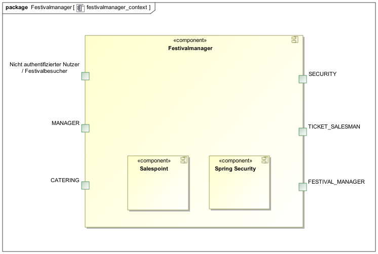
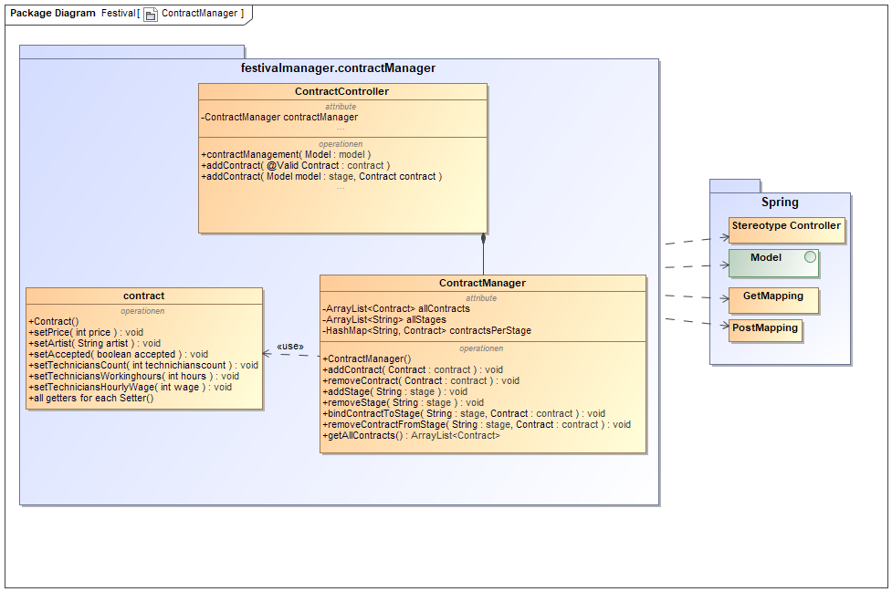
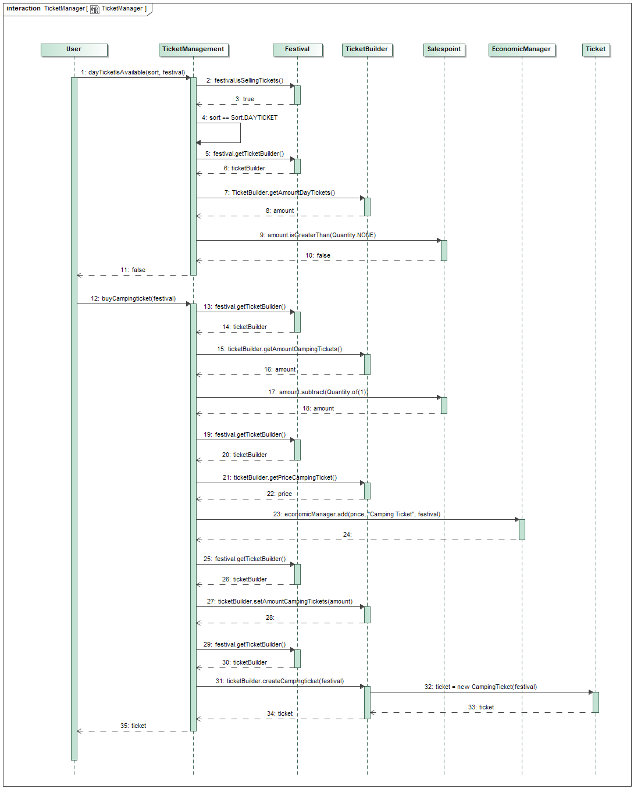
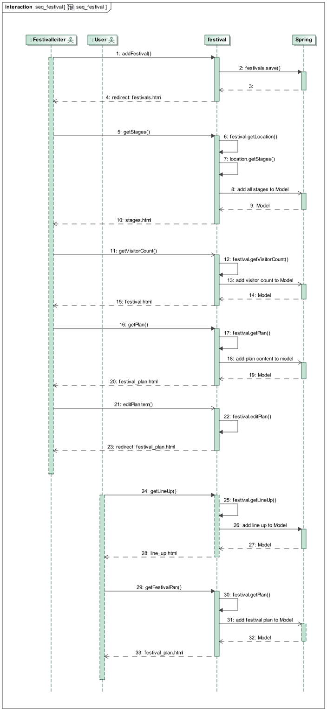

= Entwicklerdokumentation

== 1. Einführung und Ziele
=== 1.1 Aufgabenstellung
=== 1.2 Qualitätsziele
Um die Qualität der Software messen zu können, müssen Qualitätsziele definiert werden.
Diese werden in diesem Abschnitt festgelegt und beschrieben.

==== Wartbarkeit

Dieses Ziel beschreibt den Aufwand der nötig ist um die Software anzupassen
um sie zu verbessern, an neue Umstände anzupassen oder Fehler zu beheben.

==== Nutzerfreundlichkeit

Dieses Ziel beschreibt den Grad mit dem bestimmte Nutzer klar definierte Ziele effektiv und zufriedenstellend erreichen können.

==== Sicherheit

Dieses Ziel beschreibt die Sicherheit der Softwarefunktion sowie der Daten, gegenüber Angreifern.

==== Effizienz

Dieses Ziel beschreibt die notwendige Zeit und Hardwareressourcen die notwendig sind um diese Software zu benutzen.

Die Folgende Tabelle zeigt wie hoch die Priorität der einzelnen Ziele ist. Höhere Zahl bedeutet höhere Priorität.
[options="header"]
[cols="4,1,1,1,1,1"]
|===
|Qualitätsziel | 1 | 2 | 3 | 4 | 5
|Wartbarkeit | | | | x |
|Nutzerfreundlichkeit | | | x | |
|Sicherheit | | | | | x
|Effizienz | | |  |  x |
|===

== 2. Randbedingungen
=== Hardware-Vorgaben
Eine Liste der notwendigen devices / Hardware, um die Anwendung auszuführen und zu nutzen.

* Server
* Computer
* Bildschirm
* Tastatur
* Maus

=== Software-Vorgaben
Eine Liste der notwendigen Software zum Ausführen und Verwenden der Anwendung.

Die folgende (oder neuere) Java-Version ist notwendig, um die Anwendung auszuführen:

* Java 11

Die folgende (oder neuere) Maven-Version ist notwendig, um die Anwendung auszuführen:

* Apache Maven 3.6.2

Die folgende (oder neuere) Browser-Versionen sind notwendig, um die Anwendung auszuführen:

* Internet Explorer / Edge 11.0
* macOS Safari, Version 13.0.3
* Firefox 70.0.1
* Google Chrome 78.0.3904.70
* Opera 64.0.3417.92

=== Vorgaben zum Betrieb des Software
Dieser Abschnitt gibt einen Überblick darüber, wie das Produkt nach Fertigstellung und unter welchen Umständen verwendet werden soll.

Das System wird von FVIV GmbH verwendet, damit die Firma sich um seine Festivals zu kümmern. Die Software soll auf einem Server laufen und interessierten Kunden(Festivalbesucher) über das Internet (über einen Browser) rund um die Uhr zur Verfügung stehen.

Die Hauptnutzer der Software sind Mitarbeiter in einer Firma, die angeblich typische Website-Navigationsschema kennen.

Alle Daten müssen dauerhaft auf Git gespeichert sein und lokal unter localhost:8080 abrufbar sein.

== 3. Kontextabgrenzung
=== Kontextdiagramm

== 4. Lösungsstrategie
=== 4.1 Erfüllung der Qualitätsziele
[options="header"]
|=== 
|Qualitätsziel |Lösungsansatz
|Wartbarkeit a|
* Modularität Das System wird in voneinander unabhängige Komponenten gegliedert, sodass Änderung innerhalb einer Komponenten
keine Veränderung an der Interaktion mit anderen Komponenten haben.

* Modifizierbarkeit Es wird sichergestellt, dass das System  modifiert und erweitert werden kann
ohne Einschränkungen in der aktuellen Funktionsweise

|Nutzerfreundlichkeit a|
* Erlernbarkeit Das System ist leicht zu verstehen und zu benutze. Dies wird erreicht durch Beschreibungen.
* Fehlerbehandlung Ein Fehler durch Nutzereingabe führt nicht zum Absturz der Software/ Fehler verursachende Eingabe wird verhindert.
* Nutzeroberfläche Das System hat eine angenehme Intuitive grafische Nutzeroberfläche
|Sicherheit a|
* Verantwortlichkeit Aktionen können zurückverfolgt werden zu einer eindeutigen Person oder Gruppe. Um dies zu erreichen wird jede Eingabe mit einem Nutzerkonto verbunden.
* Berechtigungen Das Verändern von Daten ist nur mit entsprechenden Berechtigungen möglich.
* Vetraulichkeit Der Zugriff auf Daten ist nur mögclih mit entsprechenden Berechtigungen.
| Effizienz a|
* Speichereffizienz Verringern der Speichernutzung von Daten, Funktionen durch verwenden von geplanter Softwarestruktur
* Geschwindigkeit Erreichen einer hohen Geschwindigkeit durch Nutzen von effizienten Algorhithmen und Datenstrukturen.
|===

=== 4.2 Softwarearchitektur
Client-Server-Modell der Anwendung.
Der Client enthält nur HTML- und CSS-Dateien. Die Anwendungslogik ist auf dem Server implementiert.

HTML-Templates werden clientseitig mit den entsprechenden CSS-Stylesheets dargestellt. Die in den Vorlagen angezeigten Daten werden von Thymeleaf bereitgestellt. Thymeleaf erhält die notwendigen Daten von den Controller-Klassen, die im Backend implementiert sind. Diese Controller-Klassen hingegen verwenden Instanzen und Methoden der Modellklassen. Standardmäßig speichert eine zugrunde liegende H2-Datenbank die Daten persistent.

=== 4.2.1 Client-Server-Diagram

=== 4.3 Entwurfsentscheidungen
==== 4.3.1 Verwendete Muster
* Spring MVC
* Singleton

==== 4.3.2 Persistenz
Um die erstellten Festivals und die zugehörigen Informationen persistent zu speichern, verwenden wir eine eingebettete H2-Datenbank. Um mit unseren Objekten arbeiten zu können, wird objektrelationales Mapping mit Hilfe von Hibernate realisiert. Um den Verlust von Daten von Vorn herein auszuschließen wird die persistente Speicherung von Beginn an aktiviert. 

==== 4.3.3 Benutzeroberfläche
Die Benutzeroberfläche unserer Applikation wird hauptsächlich über HTML und CSS realisiert. Optional werden wir JavaScript einsetzen, un das Nutzererlebnis so ansprechend wie möglich zu gestalten. Hierbei ist uns jedoch wichtig, dass die Oberfläche sowohl mit, als auch ohne JavaScript genutzt werden kann. 
Um das Programm weiterhin möglichst browserunspezifisch zu testen und die größtmögliche Flexibilität zu bieten, wird die Software für die folgenden Browsern optimiert: 

* Google Chrome, Version 78.0.3904.97
* Mozilla Firefox, Version 70.0.1
* Apple Safari, Version 13.0.3

==== 4.3.4 Verwendung externer Frameworks

[options="header", cols="1,3,3"]
|===
|Externe Klasse |Pfad der externen Klasse |Verwendet von (Klasse der eigenen Anwendung)
|... |... |...
|===

== 5. Bausteinsicht

=== 5.1.1 EconomicsManager

image::./models/design/Bausteinsicht_EconomicManager.PNG["Bausteinsicht EconomicManager", 100%, 100%, pdfwidth=100%, align=center]

[options="header"]
|=== 
|Klasse/Enumeration |Beschreibung
|EconomicManager    |Diese Klasse dient zur zentralen Verwaltung aller Einnahmen und Ausgaben, um eine Übersicht zu ermöglichen.
|===

=== 5.1.2 EconomicsManager

image::./models/design/Bausteinsicht_TicketManager.PNG["Bausteinsicht TicketManager", 100%, 100%, pdfwidth=100%, align=center]

[options="header"]
|=== 
|Klasse/Enumeration |Beschreibung
|TicketManager      |Der Ticketmanager dient der Speicherung aller ausgegebenen Tickets, um einen späteren Ausdruck und die Kontrolle zu ermöglichen und das doppelte Verwenden einer Eintrittskarte zu verhindern.
|Ticket             |Das Ticket dient zum Erstellen einzelner, indvidueller Tickets
|Sort               |Enumeration um das Ticket als DAYTICKET oder CAMPING zu kategorisieren und so Berechtigungen für die Besucher festzulegen.
|EconomicManager    |Der Verkauf von Tickets ist eine Einnahmequelle, die Beträge werden in die Kosten/Ertrag-Übersicht übergeben.
|===

=== 5.1.3 ContractsManager

[options="header"]
|=== 
|Klasse/Enumeration |Beschreibung
|ContractController |Der Contractcontroller dient zur Ausgabe aller notwendigen Daten an das Thymeleaf Template zur Einarbeitung der Daten in die notwendige HTML-Page.
|ContractManager    |Der ContractManager kann Contracts erstellen und die passenren Stages dazu speichern.
|Contract               |Die Contractklasse dient dazu Contracts zwischen Künstlern und der FVIV zu erstellen, welche dann an den ContractsManager übergeben werden können und gespeichert werden.
|===

=== 5.1.4 Inventory

image::./models/design/InventoryPackage.svg["InventoryPackage", 100%, 100%, pdfwidth=100%, align=center]

[options="header"]
|=== 
|Klasse/Enumeration     |Beschreibung
|InventoryController    |Der InventoryController dient zur Ausgabe aller notwendigen Daten an das Thymeleaf Template zur Einarbeitung der Daten in die notwendige HTML-Page.
|InventoryManager       |Der InventoryManager ist die Schnittstelle zum auslesen und nachbestellen von Items im Inventar.
|Item                   |Die Item Klasse stellt die Produkte dar die vom Cateringpersonal verkauft werden können.
|CatalogInitializer     |Der CatalogInitializer erstellt zum Beginn des Programmablaufs alle Items im Katalog.
|InventoryInitializer   |Der InventoryInitializer erstellt zum Beginn des Programmablaufs alle Items im Inventar aus den Daten des Katalogs.
|===

=== 5.1.5 Festival

image::./models/design/FestivalPackage.svg["FestivalPackage", 100%, 100%, pdfwidth=100%, align=center]

[options="header"]
|=== 
|Klasse/Enumeration     |Beschreibung
|FestivalController     |Der FestivalController dient zur Ausgabe aller notwendigen Daten an das Thymeleaf Template zur Einarbeitung der Daten in die notwendige HTML-Page.
|FestivalInitializer    |Der FestivalInitializer erstellt zum Beginn des Programmablaufs alle Festivals zu Testzwecken in der Datenbank.
|Festival               |Die Festival Klasse repräsentiert die stattfindenden Festivals.
|===

=== 5.1.6 Location

image:./models/design/Bausteinsicht_Location.svg[class design diagram - location]

[options="header"]
|===
|Klasse/Enumeration |Beschreibung
|Location   |Die Location fasst alle Areas zusammen und gibt dabei eine Übersicht über die Anzahl der Besucher, Bühnen, etc.
|Area       |Areas sind einzelne Bestandteile einer Festival-Location, die verschiedene Funktionen (Type) einnehmen können.
|Stage      |Eine Stage ist eine Bühne mit individuellem Programm (Lineup), welches über diese Klasse auch verändert und eingesehen werden kann.
|Layout     |Das Layout beinhaltet einen graphischen Grundriss des Festivalgeländes.
|Type       |Der Type spezifiziert die Area und damit ihre Funktionen in der Location: +
 +
- CAMPING: Ist ein Bereich für Zelte und andere Schlafmöglichkeiten. +
- PARK: Dient zum Abstellen von Fahrzeugen, welche zur An- und Abreise verwendet werden. +
- CATERING: In diesem Bereich werden Cateringstände aufgestellt, Essen und Getränke verkauft. +
- STAGE: In diesem Bereich stehen eine oder mehrere Bühnen, auf denen die Künstler auftreten.
|===

=== 5.2 Rückverfolgbarkeit zwischen Analyse- und Entwurfsmodell

[options="header"]
|===
|Klasse/Enumeration (Analysemodell) |Klasse/Enumeration (Entwurfsmodell)
|Ticketmanager                      |TicketManager
|Ticket                             |Ticket
|Sort                               |Sort
|EconomicManager                    |EconomicManager
|PositiveAmount                     |AccountencyEntry
|NegativeAmount                     |AccountencyEntry
|ContractsManager                   |ContractManager
|Contract                           |Contract
|                                   |ContractController erstellt.
|===

== 6. Laufzeitsicht

=== 6.1 EconomicManager

image::./models/design/Laufzeitsicht_EconomicManager.PNG["Laufzeitsicht EconomicManager", 100%, 100%, pdfwidth=100%, align=center]

=== 6.2 TicketManager

=== 6.3 ContractManager

Placeholder

=== 6.4 Inventory

image::./models/design/seq_inventory.svg["Laufzeitsicht Inventory", 100%, 100%, pdfwidth=100%, align=center]

=== 6.5 Festival

=== 6.6 Location

