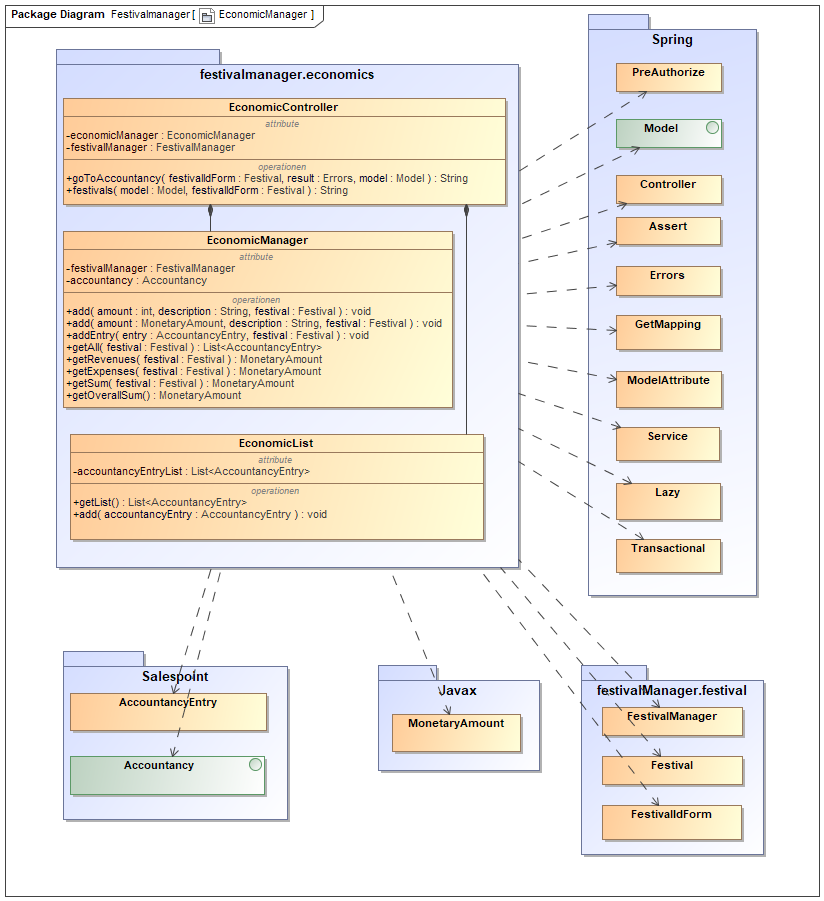
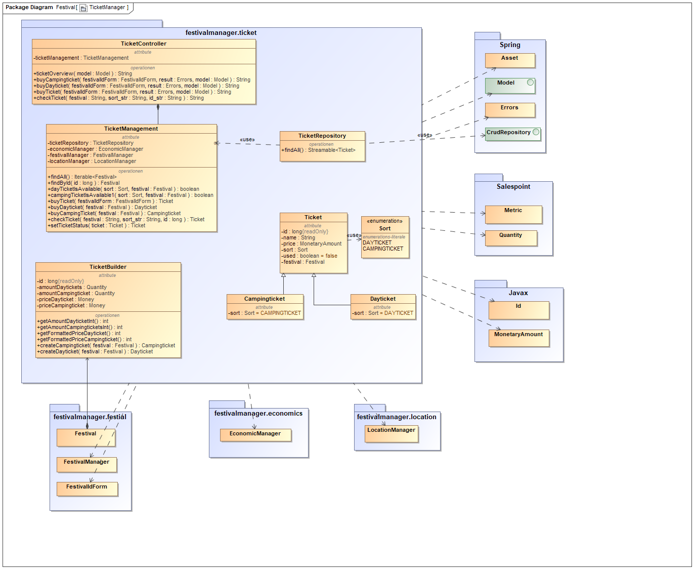
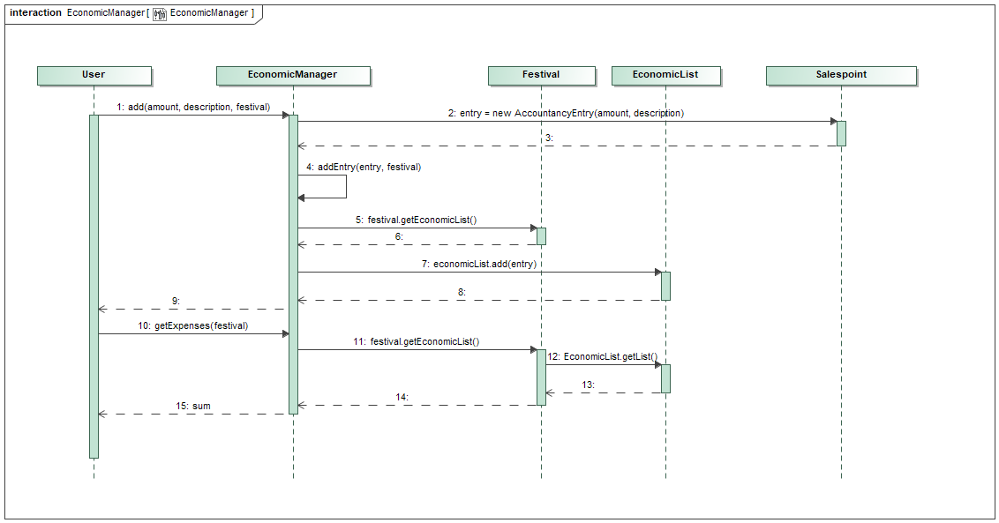

= Entwicklerdokumentation

== 1. Einführung und Ziele
* Aufgabenstellung
* Qualitätsziele

== 2. Randbedingungen
* Hardware-Vorgaben
* Software-Vorgaben
* Vorgaben zum Betrieb des Software

== 3. Kontextabgrenzung
* Kontextdiagramm

== 4. Lösungsstrategie
=== 4.1 Erfüllung der Qualitätsziele
[options="header"]
|=== 
|Qualitätsziel |Lösungsansatz
|... |...
|===

=== 4.2 Softwarearchitektur
* Beschreibung der Architektur anhand der Top-Level-Architektur oder eines Client-Server-Diagramms

=== 4.3 Entwurfsentscheidungen
==== 4.3.1 Verwendete Muster
* Spring MVC
* Singleton

==== 4.3.2 Persistenz
Um die erstellten Festivals und die zugehörigen Informationen persistent zu speichern, verwenden wir eine eingebettete H2-Datenbank. Um mit unseren Objekten arbeiten zu können, wird objektrelationales Mapping mit Hilfe von Hibernate realisiert. Um den Verlust von Daten von Vorn herein auszuschließen wird die persistente Speicherung von Beginn an aktiviert. 

==== 4.3.3 Benutzeroberfläche
Die Benutzeroberfläche unserer Applikation wird hauptsächlich über HTML und CSS realisiert. Optional werden wir JavaScript einsetzen, un das Nutzererlebnis so ansprechend wie möglich zu gestalten. Hierbei ist uns jedoch wichtig, dass die Oberfläche sowohl mit, als auch ohne JavaScript genutzt werden kann. 
Um das Programm weiterhin möglichst browserunspezifisch zu testen und die größtmögliche Flexibilität zu bieten, wird die Software für die folgenden Browsern optimiert: 

* Google Chrome, Version 78.0.3904.97
* Mozilla Firefox, Version 70.0.1
* Apple Safari, Version 13.0.3

==== 4.3.4 Verwendung externer Frameworks

[options="header", cols="1,3,3"]
|===
|Externe Klasse |Pfad der externen Klasse |Verwendet von (Klasse der eigenen Anwendung)
|... |... |...
|===

== 5. Bausteinsicht

=== 5.1.1 EconomicsManager

[options="header"]
|=== 
|Klasse/Enumeration |Beschreibung
|EconomicManager    |Diese Klasse dient zur zentralen Verwaltung aller Einnahmen und Ausgaben, um eine Übersicht zu ermöglichen.
|===

=== 5.1.2 EconomicsManager

[options="header"]
|=== 
|Klasse/Enumeration |Beschreibung
|TicketManager      |Der Ticketmanager dient der Speicherung aller ausgegebenen Tickets, um einen späteren Ausdruck und die Kontrolle zu ermöglichen und das doppelte Verwenden einer Eintrittskarte zu verhindern.
|Ticket             |Das Ticket dient zum Erstellen einzelner, indvidueller Tickets
|Sort               |Enumeration um das Ticket als DAYTICKET oder CAMPING zu kategorisieren und so Berechtigungen für die Besucher festzulegen.
|EconomicManager    |Der Verkauf von Tickets ist eine Einnahmequelle, die Beträge werden in die Kosten/Ertrag-Übersicht übergeben.
|===

=== 5.1.3 ...

=== 5.2 Rückverfolgbarkeit zwischen Analyse- und Entwurfsmodell

[options="header"]
|===
|Klasse/Enumeration (Analysemodell) |Klasse/Enumeration (Entwurfsmodell)
|Ticketmanager                      |TicketManager
|Ticket                             |Ticket
|Sort                               |Sort
|EconomicManager                    |EconomicManager
|PositiveAmount                     |AccountencyEntry
|NegativeAmount                     |AccountencyEntry
|===

== 6. Laufzeitsicht

=== 6.1. EconomicManager

=== 6.2. TicketManager

