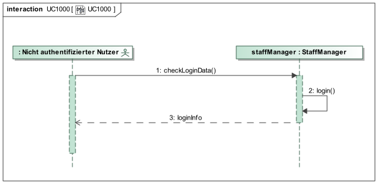

= Pflichtenheft
:project_name: Festivalmanager
== __{project_name}__

[options="header"]
[cols="1, 1, 1, 1, 4"]
|===
|Version | Status      | Bearbeitungsdatum   | Autoren(en) |  Vermerk
|0.1     | In Arbeit   | 10.10.2019          | Autor       | Initiale Version
|===

== Inhaltsverzeichnis
Dieses Dokument benötigt ein Inhaltsverzeichnis. Es existieren mehrere Einbindungsmöglichkeiten.

== Zusammenfassung
Eine kurze Beschreibung des Dokuments. Wenige Absätze.

== Aufgabenstellung und Zielsetzung
Text aus Aufgabenstellung kopieren und ggfs. präzisieren.
Insbesondere ergänzen, welche Ziele mit dem Abschluss des Projektes erreicht werden sollen.

== Produktnutzung
In welchem Kontext soll das System später genutzt werden? Welche Rahmenbedingungen gelten?
Zusätzlich kurze Einleitung für fachfremde Personen

== Interessensgruppen (Stakeholders)
Welche realen und juristischen Personen(-gruppen) haben Einfluss auf die Anforderungen im Projekt?

== Systemgrenze und Top-Level-Architektur

=== Kontextdiagramm
Das Kontextdiagramm zeigt das geplante Software-System in seiner Umgebung. Zur Umgebung gehören alle Nutzergruppen des Systems und Nachbarsysteme. Die Grafik kann auch informell gehalten sein. Überlegen Sie sich dann geeignete Symbole. Die Grafik kann beispielsweise mit Visio erstellt werden. Wenn nötig, erläutern Sie diese Grafik.

=== Top-Level-Architektur
Dokumentieren Sie ihre Top-Level-Architektur mit Hilfe eines Komponentendiagramm.

== Anwendungsfälle

=== Akteure

Akteure sind Nutzer des Systems oder benachbarter Systeme, die auf das System zugreifen. Die folgende Tabelle fasst alle Akteure des Systems zusammen und gibt eine Beschreibung des Akteurs. Abstrakte Akteure (d.h. ein Akteur, der andere Akteure gruppiert, kursiv geschrieben) werden zur Verallgemeinerung und Gruppierung verwendet.

// See http://asciidoctor.org/docs/user-manual/#tables
[options="header"]
[cols="1,4"]
|===
|Name |Beschreibung
[[User]]
|_**<<User>>**_  | Respräsentiert jeden Nutzer des Systems.
[[Nicht_Authentifizierter_Nutzer]]
|**<<Nicht authentifizierter Nutzer>>**  | Respräsentiert jeden nicht authentifizierten Nutzer des Systems.
[[Authentifizierter_Nutzer]]
|_**<<Authentifizierter Nutzer>>**_  | Respräsentiert jeden eingetragenen Nutzer des Systems.
[[Management]]
|**<<Management>>** | Jeder registrierte und authentifizierte Nutzer, mit der Rolle "MANAGEMENT".
[[Ticketverkäufer]]
|**<<Ticketverkäufer>>**  | Jeder registrierte und authentifizierte Nutzer, mit der Rolle "SELLER".
[[Cateringpersonal]]
|**<<Cateringpersonal>>** | Jeder registrierte und authentifizierte Nutzer, mit der Rolle "CATERER".
[[Festivalleiter]]
|**<<Festivalleiter>>**  | Jeder registrierte und authentifizierte Nutzer, mit der Rolle "DIRECTOR".
[[Boss]]
|**<<Boss>>** | Jeder registrierte und authentifizierte Nutzer, mit der Rolle "BOSS".
|===

=== Überblick Anwendungsfalldiagramm
image::./models/analysis/Anwendungsfalldiagramm.svg[Anwendungsfalldiagramm, 100%, 100%, pdfwidth=100%, title= "Anwendungsfalldiagramm von {project_name}", align=center]

=== Anwendungsfallbeschreibungen
Dieser Unterabschnitt beschreibt die Anwendungsfälle. In dieser Beschreibung müssen noch nicht alle Sonderfälle und Varianten berücksichtigt werden. Schwerpunkt ist es, die wichtigsten Anwendungsfälle des Systems zu finden. Wichtig sind solche Anwendungsfälle, die für den Auftraggeber, den Nutzer den größten Nutzen bringen.
Für komplexere Anwendungsfälle ein UML-Sequenzdiagramm ergänzen.
Einfache Anwendungsfälle mit einem Absatz beschreiben.
Die typischen Anwendungsfälle (Anlegen, Ändern, Löschen) können zu einem einzigen zusammengefasst werden.

[cols="1h, 3"]
[[UC1000]]
|===
|ID                          |**<<UC1000>>**
|Name                        |Login
|Beschreibung                |Ein User soll sich authentifizieren können um Zugriff auf weitere Funktionen zu erhalten.
|Akteure                     |<<Nicht_Authentifizierter_Nutzer>>
|Auslöser                    |User möchte auf versteckte Funktionen zugreifen.
|Voraussetzung(en)          a|User ist ein nicht authentifizierter Nutzer
|Wesentliche Schritte       a|

1. User klickt "Einloggen" in der Navigation
2. User gibt seine Login Daten ein
3. User klickt "Login"
4. Daten werden überprüft und User wird bei korrekten Daten auf Startseite weitergeleitet

|Funktionale Anforderungen   |<<F100>>
|===

[cols="1h, 3"]
[[UC1001]]
|===
|ID                          |**<<UC1001>>**
|Name                        |Logout
|Beschreibung                |Rückgangig machen des Einloggens.
|Akteure                     |<<Authentifizierter_Nutzer>>
|Auslöser                    |User möchte sich abmelden.
|Voraussetzung(en)          a|User ist ein authentifizierter Nutzer
|Wesentliche Schritte       a|

User klickt "Ausloggen" in der Navigation
User ist jetz unauthentifiziert und die Startseite wird angezeigt

|Funktionale Anforderungen   |<<F102>>
|===
image::./models/analysis/Sequenzdiagramme/UC1001.svg["UC1001", 100%, 100%, pdfwidth=100%, align=center]

[cols="1h, 3"]
[[UC2000]]
|===
|ID                          |**<<UC2000>>**
|Name                        |Account erstellen
|Beschreibung                |Ein Boss soll Accounts für seine Angestellten erstellen können.
|Akteure                     |<<Boss>>
|Auslöser                    |Boss möchte Angestellten Zugriff auf versteckte Funktionen erlauben.
|Voraussetzung(en)          a|User hat die Rolle "BOSS"
|Wesentliche Schritte       a|

1. Boss klickt "Organisation" in der Navigation
2. Boss füllt Formular mit Name und Passwort aus
3. Boss bestätigt Eingaben und wird weitergeleitet
4. Account wird angelegt
5. Boss wird auf "Organisation" weitergeleitet

|Funktionale Anforderungen   |<<F103>>
|===
image::./models/analysis/Sequenzdiagramme/UC2000.svg["UC2000", 100%, 100%, pdfwidth=100%, align=center]

[cols="1h, 3"]
[[UC2001]]
|===
|ID                          |**<<UC2001>>**
|Name                        |betriebswirtschaftliche Daten abrufen
|Beschreibung                |Ein Boss soll betriebswirtschaftliche Daten abrufen wie Umsatz, Ausgaben, Gewinn abrufen können.
|Akteure                     |<<Boss>>
|Auslöser                    |Boss möchte Ein- und Ausgaben einsehen.
|Voraussetzung(en)          a|User hat die Rolle "BOSS"
|Wesentliche Schritte       a|

1. Boss klickt "Organisation" in der Navigation

|Funktionale Anforderungen   |<<F132>>
|===
image::./models/analysis/Sequenzdiagramme/UC2001.svg["UC2001", 100%, 100%, pdfwidth=100%, align=center]

[cols="1h, 3"]
[[UC2002]]
|===
|ID                          |**<<UC2002>>**
|Name                        |Angemeldete Mitarbeiter anzeigen
|Beschreibung                |Ein Boss soll abrufen können welche Mitarbeiter derzeitig eingeloggt sind.
|Akteure                     |<<Boss>>
|Auslöser                    |Boss möchte eingeloggte Mitarbeiter sehen
|Voraussetzung(en)          a|Es gibt authentifizierter Nutzer im System
|Wesentliche Schritte       a|

1. Boss klickt "Organisation" in der Navigation

|Funktionale Anforderungen   |<<F133>>
|===
image::./models/analysis/Sequenzdiagramme/UC2002.svg["UC2002", 100%, 100%, pdfwidth=100%, align=center]

[cols="1h, 3"]
[[UC3000]]
|===
|ID                          |**<<UC3000>>**
|Name                        |Speisen/Getränke abrechnen
|Beschreibung                |Ein Caterer soll Speisen online abbuchen können.
|Akteure                     |<<Cateringpersonal>>
|Auslöser                    |Caterer möchte Speisen/Getränke abrechnen
|Voraussetzung(en)          a|Es sind noch Speisen/Getränke auf Lager
|Wesentliche Schritte       a|

1. Caterer klickt "Catering" in Navigation
2. Caterer wählt Speise/Getränk in Formular
3. Caterer gibt Anzahl der gekauften Speisen/Getränke ein
4. Caterer bestätigt und wird weitergeleitet
5. Abrechnung wird bearbeitet und Caterer wird auf "Catering" weitergeleitet

|Funktionale Anforderungen   |<<F134>>
|===
image::./models/analysis/Sequenzdiagramme/UC3000.svg["UC3000", 100%, 100%, pdfwidth=100%, align=center]

[cols="1h, 3"]
[[UC3001]]
|===
|ID                          |**<<UC3001>>**
|Name                        |Verkaufszahlen des Caterings abrufen
|Beschreibung                |Ein Festivalleiter soll die Verkaufszahlen des Cateringbereichs abrufen können.
|Akteure                     |<<Festivalleiter>>
|Auslöser                    |Festivalleiter klickt "Catering" in der Navigation
|Voraussetzung(en)          a|-
|Wesentliche Schritte       a|

1. Festivalleiter klickt "Catering" in Navigation

|Funktionale Anforderungen   |<<F117>>
|===

[cols="1h, 3"]
[[UC4000]]
|===
|ID                          |**<<UC4000>>**
|Name                        |Ticket verkaufen
|Beschreibung                |Ein Ticketverkäufer soll Ticktes verkaufen können.
|Akteure                     |<<Ticketverkäufer>>
|Auslöser                    |Kunde möchte Ticket(s) kaufen
|Voraussetzung(en)          a|Es sind Tickets verfügbar
|Wesentliche Schritte       a|

1. Ticketverkäufer klickt "Tickets" in Navigation
2. Ticketverkäufer wählt Ticketart
3. Ticketverkäufer gibt Anzahl der Tickets ein
4. Ticketverkäufer bestätigt und wird weitergeleitet
5. Ticketkauf wird bearbeitet und Ticketverkäufer wird auf auf eine Seite weitergeleitet, auf der er das Ticket ausdrucken kann.

|Funktionale Anforderungen   |<<F125>>
|===
image::./models/analysis/Sequenzdiagramme/UC4000.svg["UC4000", 100%, 100%, pdfwidth=100%, align=center]

[cols="1h, 3"]
[[UC4001]]
|===
|ID                          |**<<UC4001>>**
|Name                        |Ticket drucken
|Beschreibung                |Ein Ticketverkäufer soll Ticktes drucken können.
|Akteure                     |<<Ticketverkäufer>>
|Auslöser                    |Ticketverkäufer möchte Ticket(s) drucken
|Voraussetzung(en)          a|Das Ticket wurde erfolgreich gekauft
|Wesentliche Schritte       a|

1. Ticketverkäufer klickt "Ausdrucken"

|Funktionale Anforderungen   |<<F126>>
|===

[cols="1h, 3"]
[[UC5000]]
|===
|ID                          |**<<UC5000>>**
|Name                        |Kostenaufstellung abrufen
|Beschreibung                |Ein Planer soll die Kostenaufstellen jederzeit einsehen können.
|Akteure                     |<<Management>>
|Auslöser                    |Planer möchte Kostenaufstellung einsehen
|Voraussetzung(en)          a|Das Festival wurde angelegt
|Wesentliche Schritte       a|

1. Planer klickt "Planung" in der Navigation

|Funktionale Anforderungen   |<<F131>>
|===

[cols="1h, 3"]
[[UC5001]]
|===
|ID                          |**<<UC5001>>**
|Name                        |Bereiche anpassen
|Beschreibung                |Ein Planer soll die Festivalbereiche wie Toiletten, Cateringstände, Bühnen anpassen können.
|Akteure                     |<<Management>>
|Auslöser                    |Planer möchte Bereichsänderung vornehmen
|Voraussetzung(en)          a|Das Festival wurde angelegt
|Wesentliche Schritte       a|

1. Planer klickt "Festival" in der Navigation
2. Planer wählt gewünschten Bereich
3. Planer wählt gewünschte Anpassung wie Position, Menge
4. Planer bestätigt Formular un wird weitergeleitet
5. Änderung wird bearbeitet und Planer wird auf "Festival" weitergeleitet

|Funktionale Anforderungen   |<<F106>>
|===
image::./models/analysis/Sequenzdiagramme/UC5001.svg["UC5001", 100%, 100%, pdfwidth=100%, align=center]

[cols="1h, 3"]
[[UC6000]]
|===
|ID                          |**<<UC6000>>**
|Name                        |Festivalplan anzeigen
|Beschreibung                |Jeder User soll den Festivalplan einsehen können.
|Akteure                     |<<User>>
|Auslöser                    |User möchte Festivalplan einsehen
|Voraussetzung(en)          a|Das Festival wurde angelegt
|Wesentliche Schritte       a|

1. User klickt "Festival" in der Navigation

|Funktionale Anforderungen   |<<F105>>
|===

[cols="1h, 3"]
[[UC6001]]
|===
|ID                          |**<<UC6001>>**
|Name                        |Line-Up anzeigen
|Beschreibung                |Jeder User soll das Line-Up einsehen können.
|Akteure                     |<<User>>
|Auslöser                    |User möchte Line-Up einsehen
|Voraussetzung(en)          a|

1. Das Festival wurde angelegt
2. Es wurden Künstler gebucht

|Wesentliche Schritte       a|

1. User klickt "Festival" in der Navigation

|Funktionale Anforderungen   |<<F112>>
|===
image::./models/analysis/Sequenzdiagramme/UC6001.svg["UC6001", 100%, 100%, pdfwidth=100%, align=center]

[cols="1h, 3"]
[[UC6002]]
|===
|ID                          |**<<UC6002>>**
|Name                        |Nachrichten von Mitarbeitern abrufen
|Beschreibung                |Ein Festivalleiter soll die Nachrichten von Mitarbeitern abrufen einsehen können.
|Akteure                     |<<Festivalleiter>>
|Auslöser                    |Festivalleiter möchte Nachrichten von Mitarbeitern abrufen
|Voraussetzung(en)          a|Das Festival wurde angelegt
|Wesentliche Schritte       a|

1. Festivalleiter klickt "Festival" in der Navigation

|Funktionale Anforderungen   |<<F121>>
|===
image::./models/analysis/Sequenzdiagramme/UC6002.svg["UC6002", 100%, 100%, pdfwidth=100%, align=center]

[cols="1h, 3"]
[[UC6003]]
|===
|ID                          |**<<UC6003>>**
|Name                        |Besucherzahlen abrufen
|Beschreibung                |Ein Festivalleiter soll die Besucherzahlen einsehen können.
|Akteure                     |<<Festivalleiter>>
|Auslöser                    |Festivalleiter möchte Besucherzahlen einsehen
|Voraussetzung(en)          a|Das Festival wurde angelegt
|Wesentliche Schritte       a|

1. Festivalleiter klickt "Festival" in der Navigation

|Funktionale Anforderungen   |<<F116>>
|===
image::./models/analysis/Sequenzdiagramme/UC6003.svg["UC6003", 100%, 100%, pdfwidth=100%, align=center]

[cols="1h, 3"]
[[UC6004]]
|===
|ID                          |**<<UC6004>>**
|Name                        |Bühnenbelegung abrufen
|Beschreibung                |Ein Festivalleiter soll die Bühnenbelegung einsehen können.
|Akteure                     |<<Festivalleiter>>
|Auslöser                    |Festivalleiter möchte Bühnenbelegung einsehen
|Voraussetzung(en)          a|Das Festival wurde angelegt
|Wesentliche Schritte       a|

1. Festivalleiter klickt "Festival" in der Navigation

|Funktionale Anforderungen   |<<F115>>
|===
image::./models/analysis/Sequenzdiagramme/UC6004.svg["UC6004", 100%, 100%, pdfwidth=100%, align=center]

[cols="1h, 3"]
[[UC7000]]
|===
|ID                          |**<<UC7000>>**
|Name                        |Produkte nachbestellen
|Beschreibung                |Ein Festivalleiter soll Produkte nachbestellen können.
|Akteure                     |<<Festivalleiter>>
|Auslöser                    |Festivalleiter möchte Produkte nachbestellen
|Voraussetzung(en)          a|Das Festival wurde angelegt
|Wesentliche Schritte       a|

1. Festivalleiter klickt "Lager" in der Navigation
2. Festivalleiter wählt nachzubestellendes Produkt und Menge aus
3. Festivalleiter bestätigt Formular und wird weitergeleitet
4. Nachbestellung wird verarbeitet und Festivalleiter wird auf "Lager" weitergeleitet

|Funktionale Anforderungen   |<<F118>>
|===
image::./models/analysis/Sequenzdiagramme/UC7000.svg["UC7000", 100%, 100%, pdfwidth=100%, align=center]

[cols="1h, 3"]
[[UC7001]]
|===
|ID                          |**<<UC7001>>**
|Name                        |Lagerbestand anzeigen
|Beschreibung                |Ein Festivalleiter soll den aktuellen Lagerbestand einsehen können.
|Akteure                     |<<Festivalleiter>>
|Auslöser                    |Festivalleiter möchte Lagerbestand einsehen
|Voraussetzung(en)          a|Das Festival wurde angelegt
|Wesentliche Schritte       a|

1. Festivalleiter klickt "Lager" in der Navigation

|Funktionale Anforderungen   |<<F117>>
|===

== Funktionale Anforderungen
Die folgende Tabellen zeigen Funktionale Kriterien des Systems auf, sie sind untergliedert in Muss- und Kannkriterien.
Die Tabellen enthalten:

* eine einzigartige ID für Referenzen
* Die aktuelle Version der Funktion
* Den Namen der Funktion
* Eine Beschreibung der Funktion

=== Muss-Kriterien
[options="header"]
[cols="1, 1, 2, 4"]
|===
|ID | Version | Name | Beschreibung
|[[F100]] <<F100>> | 0.1 | Login | Ein nicht angemeldeter Benutzer muss sich durch Eingabe von Nutzername und Passwort Einloggen können um erweiterte Berechtigungen nutzen zu können.
|[[F101]] <<F101>> | 0.1 | Logout | Ein angemeldeter Benutzer muss sich abmelden können sodass nur noch die öffentlichen Teile der App zugänglich sind.
|[[F102]] <<F102>> | 0.1 | Account erstellen | Der Boss muss einen Nutzeraccount erstellen können indem er die Berechtigungen, Nutzername und Passwort angibt.
|[[F103]] <<F103>> | 0.1 | Festival anzeigen | Das System muss alle Informationen zu einem Festival zum Teil graphisch darstellen können.
|[[F104]] <<F104>> | 0.1 | Festival anlegen | Der Boss muss neue Festivals erstellen können unter Angabe von Zeitraum und Ort. Ist nur möglich wenn der Ort zu dieser Zeit noch nicht belegt ist.
|[[F105]] <<F105>> | 0.1 | Lageplan anzeigen | Das System muss zu einem gegeben Festival den Lageplan visualisieren können.
|[[F106]] <<F106>> | 0.1 | Bereich anpassen | Der Festivalleiter muss die Belegung und den Typ eines Bereiches sowie die Anordnung von Toiletten und Cateringständen ändern können.
|[[F107]] <<F107>> | 0.1 | Bereiche sperren | Der Festivalleiter muss Bereiche sperren können.
|[[F108]] <<F108>> | 0.1 | Bühnenposition ändern | Der Festivalleiter muss die Bühnenpositionen ändern können.
|[[F109]] <<F109>> | 0.1 | Toilettenbestückung ändern | Der Festivalleiter muss die Toilettenbestückung ändern können.
|[[F110]] <<F110>> | 0.1 | Cateringstände anpassen | Der Festivalleiter muss die Ausstattung der Cateringstände ändern können.
|[[F111]] <<F111>> | 0.1 | Lineup erstellen | Der Festivalleiter muss aus verfügbaren Künstlern ein Linup für eine Bühne erstellen können.
|[[F112]] <<F112>> | 0.1 | Lineup anzeigen | Das System muss jedes Lineup mit Angabe der Bühne und des Festivals ausgeben können.
|[[F113]] <<F113>> | 0.1 | Angebot einholen | Angebote müssen von Künstlern eingeholt und gespeichert werden können.
|[[F114]] <<F114>> | 0.1 | Angebot annehmen | Ein Angebot eines Künstlers muss bestätigt werden können.
|[[F115]] <<F115>> | 0.1 | Bühnenbelegung abrufen | Der Festivalleiter muss jede Bühnenbelegung abrufen können.
|[[F116]] <<F116>> | 0.1 | Besucherzahlen abrufen | Der Festivalleiter muss die Besucherzahlene abrufen können.
|[[F117]] <<F117>> | 0.1 | Lagerbestand einsehen | Der Festivalleiter muss den Lagerbestand einsehen können.
|[[F118]] <<F118>> | 0.1 | Produkte nachbestellen | Der Festivalleiter muss Produkte nachbestellen können.
|[[F119]] <<F119>> | 0.1 | Produkt hinzufügen | Der Festivalleiter muss dem Lager ein neues Produkt hinzufügen können.
|[[F120]] <<F120>> | 0.1 | Mindestbestand festlegen | Der Festivalleiter muss für ein Produkt den Mindestbestand festlegen können.
|[[F121]] <<F121>> | 0.1 | Nachrichten einsehen | Der Festivalleiter muss Nachrichten von anderen Mitarbeitern einsehen können.
|[[F122]] <<F122>> | 0.1 | Nachricht versenden | Jeder authentifizierte User muss Nachrichten an den Festivalleiter versenden können.
|[[F123]] <<F123>> | 0.1 | Ticketpreis festlegen | Für ein Festival muss der Ticketpreis für jeden Typ getrennt festgelegt werden können.
|[[F124]] <<F124>> | 0.1 | Festival freigeben | Die Tickets für ein Festival müssen zum Verkauf freigegeben können.
|[[F125]] <<F125>> | 0.1 | Ticket verkaufen | Ein Verkäufer muss ein Ticket als verkauft markieren können. Dieses muss dann aus dem Restbestand entfernt werden.
|[[F126]] <<F126>> | 0.1 | Ticket drucken | Ein Ticket muss vom Verkäufer ausgedruckt werden können, vorrausgesetzt es wurde als verkauft markiert.
|[[F127]] <<F127>> | 0.1 | Personal mieten | Personal muss angemietet werden können mit Angabe von Typ des Personals, Anzahl und Stundenlohn.
|[[F128]] <<F128>> | 0.1 | Personal zuordnen | Personal muss einer Arbeitsstelle zugeordnet werden können.
|[[F129]] <<F129>> | 0.1 | Personal abrechnen | Das Gehalt muss für das Personal berechnet und ausgezahlt werden können.
|[[F130]] <<F130>> | 0.1 | Veranstaltungsleiter abrechnen  | Das Gehalt muss für den Veranstaltungsleiter berechnet und ausgezahlt werden können.
|[[F131]] <<F131>> | 0.1 | Gegenstände mieten | Gegenstände müssen unter Angabe des Typs und der Anzahl bestellt, zugeordnet und bezahlt werden können.
|[[F132]] <<F132>> | 0.1 | betriebswirtschaftliche Daten anzeigen | Der Boss muss in der Lage sein sich die betriebswirtschaftlichen Daten anzeigen zu lassen.
|[[F133]] <<F133>> | 0.1 | Aktive Accounts anzeigen | Der Boss muss in der Lage sein alle angemeldeten Accounts sich anzeigen zu lassen.
|[[F134]] <<F134>> | 0.1 | Produkt abrechnen | Das Cateringpersonal muss am Terminal ein Produkt verkaufen können. Lager und betriebswirtschaftliche Daten müssen entsprechend angepasst werden.
|[[F135]] <<F135>> | 0.1 | Kostenaufstellung | Das Management muss sich jederzeit eine Kostenaufstellung anzeigen lassen können. Diese muss gegliedert sein in Personal, Gagen, Mieten und sonstiges.
|===
=== Kann-Kriterien
Anforderungen die das Programm leisten können soll, aber für den korrekten Betrieb entbehrlich sind.
[options="header"]
[cols="1, 1, 2, 4"]
|===
|ID | Version | Name | Beschreibung
|[[F201]] <<F201>> | 0.1 | Account Berechtigungen ändern | Der Boss und/ oder der Festivalleiter soll die Berechtigungen von existierenden Accounts ändern können
|[[F202]] <<F202>> | 0.1 | Accounts anzeigen | Der Boss soll sich alle existierenden Accounts und deren zugeordneten Nutzer anzeigen lassen können
|[[F203]] <<F203>> | 0.1 | Messagesystem | Das Messagesystem soll für alle Mitarbeiter ausgeweitet werden.
|[[F204]] <<F204>> | 0.1 | Mehrsprachigkeit | Das System soll in mehreren Sprachen nutzbar sein.
|===
== Nicht-Funktionale Anforderungen

=== Qualitätsziele

Die folgende Tabelle enthält nicht funtionale Qualitätsziele und eine Einstufung ihrer Wichtigkeit.
1 = nicht wichtig ... 5 = sehr wichtig

[options="header"]
[cols="4,1,1,1,1,1"]
|===
|Qualitätsziel | 1 | 2 | 3 | 4 | 5
|Wartbarkeit | | | |x |
|Sicherheit | | | | | x
|Nutzerfreundlichkeit | | | x | |
|===

=== Konkrete Nicht-Funktionale Anforderungen

[options="header"]
[cols="1, 1, 2, 4"]
|===
|ID | Version | Name | Beschreibung
|[[NF301]] <<NF301>> | 0.1 | uptime | Das System soll 99,5% der Zeit erreichbar sein
|[[NF302]] <<NF302>> | 0.1 | Mehrsprachig | Das System soll die Möglichkeit haben in mehreren Sprachen benutzt zu werden
|[[NF303]] <<NF303>> | 0.1 | Sicherheit - Accounts | Die Accountdaten sollen ein Mindestlevel an Sicherheit haben durch Mindestlänge und Benutzen von Groß- u. Kleinbuchstaben, Zahlen sowie Sonderzeichen
|[[NF304]] <<NF304>>   | 0.1 | Sicherheit - Data | Die betriebswirtschaftlichen Daten sollen nur verschlüsselt gespeichert werden
|===

== GUI Prototyp
Startbildschirm / Index, der auf jedem Terminal vor dem Einloggen zu sehen ist.

image::./models/analysis/2. Planungsabteilung Planung.PNG["2. Planungsabteilung Planung", 100%, 100%, pdfwidth=100%, align=center]

image::./models/analysis/4. Planungsabteilung LineUp.PNG["4. Planungsabteilung LineUp", 100%, 100%, pdfwidth=100%, align=center]

image::./models/analysis/5. Planungsabteilung Kostenabrechnung.PNG["5. Planungsabteilung Kostenabrechnung", 100%, 100%, pdfwidth=100%, align=center]

image::./models/analysis/6. Karten Index.PNG["6. Karten Index.PNG", 100%, 100%, pdfwidth=100%, align=center]

image::./models/analysis/7. Catering Index.PNG["7. Catering Index", 100%, 100%, pdfwidth=100%, align=center]

image::./models/analysis/8. Festivalleiter Index.PNG["8. Festivalleiter Index", 100%, 100%, pdfwidth=100%, align=center]

image::./models/analysis/9. Festivalleiger Lager.PNG["9. Festivalleiger Lager", 100%, 100%, pdfwidth=100%, align=center]

image::./models/analysis/14. Der Manager angemeldete Mitarbeiter.PNG["14. Der Manager angemeldete Mitarbeiter", 100%, 100%, pdfwidth=100%, align=center]

=== Überblick: Dialoglandkarte
image::./models/analysis/Dialoglandkarte.PNG["Dialoglandkarte", 100%, 100%, pdfwidth=100%, align=center]

=== Dialogbeschreibung
Für jeden Dialog:

1. Kurze textuelle Dialogbeschreibung eingefügt: Was soll der jeweilige Dialog? Was kann man damit tun? Überblick?
2. Maskenentwürfe (Screenshot, Mockup)
3. Maskenelemente (Ein/Ausgabefelder, Aktionen wie Buttons, Listen, …)
4. Evtl. Maskendetails, spezielle Widgets

== Datenmodell

=== Überblick: Klassendiagramm
UML-Analyseklassendiagramm

=== Klassen und Enumerationen
Dieser Abschnitt stellt eine Vereinigung von Glossar und der Beschreibung von Klassen/Enumerationen dar. Jede Klasse und Enumeration wird in Form eines Glossars textuell beschrieben. Zusätzlich werden eventuellen Konsistenz- und Formatierungsregeln aufgeführt.

// See http://asciidoctor.org/docs/user-manual/#tables
[options="header"]
|===
|Klasse/Enumeration |Beschreibung |
|Area                  |Areas sind einzelne Bestandteile einer Festival-Location, die verschiedene Funktionen (Type) einnehmen können.
|CateringPersonal      |CateringPersonal ist ein Personaltyp, welcher für den Verkauf von Lebensmitteln auf dem Festival zuständig ist.
|Contract              |Ein Contract beschreibt einen Vertrag mit einem Künstler und hält die ausgehandelten Konditionen fest.
|ContractManager       |Der ContractManager verwaltet die Contracts und kann eine Kostenaufstellung über diese liefern.
|EconomicManager       |Der EconomicManager verwaltet die Kosten- und Gewinnpunkte, die mit dem Festival verbunden sind und kann eine Gesamtübersicht erstellen.
|Festival              |Das Festival beschreibt das gesamte Event und beinhaltet einige Getter-Funktionen, über welche sich allgemeine Informationen über das Festival abfragen lassen.
|Festivalmanager       |Der Festivalmanager verwaltet die einzelnen Festivals.
|InventoryManager      |Der InventoryManager dient als Lagersystem, in dem die vorhandenen Items eingesehen, verwaltet und nachbestellt werden können.
|Item                  |Das Item stellt ein zugekauftes Produkte dar, dabei kann es sich um Lebensmittel oder auch um gemietete Dinge wie Bühnen handeln.
|Layout                |Das Layout beinhaltet einen graphischen Grundriss des Festivalgeländes.
|Location              |Die Location fasst alle Areas zusammen und gibt dabei eine Übersicht über die Anzahl der Besucher, Bühnen, etc.
|Login                 |Ein Login beschreibt den Login-Vorgang eines Mitarbeiters mit seinen Zugangsdaten in ein Terminal.
|Manager               |Der Manager ist ein Personaltyp, der das Festival leitet und demtentsprechende Berechtigungen über Personal, Lager und Lineup hat.
|Message               |Eine Message beschreibt eine Nachricht von einem Mitarbeiter an einen anderen.
|MessageController     |Der MessageController verwaltet die Nachrichten und erlaubt es seinen Nutzern, die für ihn bestimmten Messages abzurufen.
|NegativeAmount        |
|PositiveAmount        |
|Security              |
|Staff                 |
|Staffmanager          |
|Stage                 |
|Sort                  |
|Ticket                |
|Ticketmanager         |
|TicketSalesman        |
|Type                  |
|===
== Akzeptanztestfälle
Mithilfe von Akzeptanztests wird geprüft, ob die Software die funktionalen Erwartungen und Anforderungen im Gebrauch erfüllt. Diese sollen und können aus den Anwendungsfallbeschreibungen und den UML-Sequenzdiagrammen abgeleitet werden. D.h., pro (komplexen) Anwendungsfall gibt es typischerweise mindestens ein Sequenzdiagramm (welches ein Szenarium beschreibt). Für jedes Szenarium sollte es einen Akzeptanztestfall geben. Listen Sie alle Akzeptanztestfälle in tabellarischer Form auf.
Jeder Testfall soll mit einer ID versehen werde, um später zwischen den Dokumenten (z.B. im Test-Plan) referenzieren zu können.

== Glossar
Sämtliche Begriffe, die innerhalb des Projektes verwendet werden und deren gemeinsames Verständnis aller beteiligten Stakeholder essentiell ist, sollten hier aufgeführt werden.
Insbesondere Begriffe der zu implementierenden Domäne wurden bereits beschrieben, jedoch gibt es meist mehr Begriffe, die einer Beschreibung bedürfen. +
Beispiel: Was bedeutet "Kunde"? Ein Nutzer des Systems? Der Kunde des Projektes (Auftraggeber)?

== Offene Punkte
Offene Punkte werden entweder direkt in der Spezifikation notiert. Wenn das Pflichtenheft zum finalen Review vorgelegt wird, sollte es keine offenen Punkte mehr geben.
=======
= Pflichtenheft
:project_name: Festivalmanager
== __{project_name}__

[options="header"]
[cols="1, 1, 1, 1, 4"]
|===
|Version | Status      | Bearbeitungsdatum   | Autoren(en) |  Vermerk
|0.1     | In Arbeit   | 10.10.2019          | Autor       | Initiale Version
|===

== Inhaltsverzeichnis
Dieses Dokument benötigt ein Inhaltsverzeichnis. Es existieren mehrere Einbindungsmöglichkeiten.

== Zusammenfassung
Eine kurze Beschreibung des Dokuments. Wenige Absätze.

== Aufgabenstellung und Zielsetzung
Text aus Aufgabenstellung kopieren und ggfs. präzisieren.
Insbesondere ergänzen, welche Ziele mit dem Abschluss des Projektes erreicht werden sollen.

== Produktnutzung
In welchem Kontext soll das System später genutzt werden? Welche Rahmenbedingungen gelten?
Zusätzlich kurze Einleitung für fachfremde Personen

== Interessensgruppen (Stakeholders)
Welche realen und juristischen Personen(-gruppen) haben Einfluss auf die Anforderungen im Projekt?

== Systemgrenze und Top-Level-Architektur

=== Kontextdiagramm
Das Kontextdiagramm zeigt das geplante Software-System in seiner Umgebung. Zur Umgebung gehören alle Nutzergruppen des Systems und Nachbarsysteme. Die Grafik kann auch informell gehalten sein. Überlegen Sie sich dann geeignete Symbole. Die Grafik kann beispielsweise mit Visio erstellt werden. Wenn nötig, erläutern Sie diese Grafik.

=== Top-Level-Architektur
Dokumentieren Sie ihre Top-Level-Architektur mit Hilfe eines Komponentendiagramm.

== Anwendungsfälle

=== Akteure

Akteure sind Nutzer des Systems oder benachbarter Systeme, die auf das System zugreifen. Die folgende Tabelle fasst alle Akteure des Systems zusammen und gibt eine Beschreibung des Akteurs. Abstrakte Akteure (d.h. ein Akteur, der andere Akteure gruppiert, kursiv geschrieben) werden zur Verallgemeinerung und Gruppierung verwendet.

// See http://asciidoctor.org/docs/user-manual/#tables
[options="header"]
[cols="1,4"]
|===
|Name |Beschreibung
[[User]]
|_**<<User>>**_  | Respräsentiert jeden Nutzer des Systems.
[[Nicht_Authentifizierter_Nutzer]]
|**<<Nicht authentifizierter Nutzer>>**  | Respräsentiert jeden nicht authentifizierten Nutzer des Systems.
[[Authentifizierter_Nutzer]]
|_**<<Authentifizierter Nutzer>>**_  | Respräsentiert jeden eingetragenen Nutzer des Systems.
[[Management]]
|**<<Management>>** | Jeder registrierte und authentifizierte Nutzer, mit der Rolle "MANAGEMENT".
[[Ticketverkäufer]]
|**<<Ticketverkäufer>>**  | Jeder registrierte und authentifizierte Nutzer, mit der Rolle "SELLER".
[[Cateringpersonal]]
|**<<Cateringpersonal>>** | Jeder registrierte und authentifizierte Nutzer, mit der Rolle "CATERER".
[[Festivalleiter]]
|**<<Festivalleiter>>**  | Jeder registrierte und authentifizierte Nutzer, mit der Rolle "DIRECTOR".
[[Boss]]
|**<<Boss>>** | Jeder registrierte und authentifizierte Nutzer, mit der Rolle "BOSS".
|===

=== Überblick Anwendungsfalldiagramm
image::./models/analysis/Anwendungsfalldiagramm.svg[Anwendungsfalldiagramm, 100%, 100%, pdfwidth=100%, title= "Anwendungsfalldiagramm von {project_name}", align=center]

=== Anwendungsfallbeschreibungen
Dieser Unterabschnitt beschreibt die Anwendungsfälle. In dieser Beschreibung müssen noch nicht alle Sonderfälle und Varianten berücksichtigt werden. Schwerpunkt ist es, die wichtigsten Anwendungsfälle des Systems zu finden. Wichtig sind solche Anwendungsfälle, die für den Auftraggeber, den Nutzer den größten Nutzen bringen.
Für komplexere Anwendungsfälle ein UML-Sequenzdiagramm ergänzen.
Einfache Anwendungsfälle mit einem Absatz beschreiben.
Die typischen Anwendungsfälle (Anlegen, Ändern, Löschen) können zu einem einzigen zusammengefasst werden.

[cols="1h, 3"]
[[UC1000]]
|===
|ID                          |**<<UC1000>>**
|Name                        |Login
|Beschreibung                |Ein User soll sich authentifizieren können um Zugriff auf weitere Funktionen zu erhalten.
|Akteure                     |<<Nicht_Authentifizierter_Nutzer>>
|Auslöser                    |User möchte auf versteckte Funktionen zugreifen.
|Voraussetzung(en)          a|User ist ein nicht authentifizierter Nutzer
|Wesentliche Schritte       a|

1. User klickt "Einloggen" in der Navigation
2. User gibt seine Login Daten ein
3. User klickt "Login"
4. Daten werden überprüft und User wird bei korrekten Daten auf Startseite weitergeleitet

|Funktionale Anforderungen   |<<F100>>
|===

[cols="1h, 3"]
[[UC1001]]
|===
|ID                          |**<<UC1001>>**
|Name                        |Logout
|Beschreibung                |Rückgangig machen des Einloggens.
|Akteure                     |<<Authentifizierter_Nutzer>>
|Auslöser                    |User möchte sich abmelden.
|Voraussetzung(en)          a|User ist ein authentifizierter Nutzer
|Wesentliche Schritte       a|

User klickt "Ausloggen" in der Navigation
User ist jetz unauthentifiziert und die Startseite wird angezeigt

|Funktionale Anforderungen   |<<F102>>
|===
image::./models/analysis/Sequenzdiagramme/UC1001.svg["UC1001", 100%, 100%, pdfwidth=100%, align=center]

[cols="1h, 3"]
[[UC2000]]
|===
|ID                          |**<<UC2000>>**
|Name                        |Account erstellen
|Beschreibung                |Ein Boss soll Accounts für seine Angestellten erstellen können.
|Akteure                     |<<Boss>>
|Auslöser                    |Boss möchte Angestellten Zugriff auf versteckte Funktionen erlauben.
|Voraussetzung(en)          a|User hat die Rolle "BOSS"
|Wesentliche Schritte       a|

1. Boss klickt "Organisation" in der Navigation
2. Boss füllt Formular mit Name und Passwort aus
3. Boss bestätigt Eingaben und wird weitergeleitet
4. Account wird angelegt
5. Boss wird auf "Organisation" weitergeleitet

|Funktionale Anforderungen   |<<F103>>
|===
image::./models/analysis/Sequenzdiagramme/UC2000.svg["UC2000", 100%, 100%, pdfwidth=100%, align=center]

[cols="1h, 3"]
[[UC2001]]
|===
|ID                          |**<<UC2001>>**
|Name                        |betriebswirtschaftliche Daten abrufen
|Beschreibung                |Ein Boss soll betriebswirtschaftliche Daten abrufen wie Umsatz, Ausgaben, Gewinn abrufen können.
|Akteure                     |<<Boss>>
|Auslöser                    |Boss möchte Ein- und Ausgaben einsehen.
|Voraussetzung(en)          a|User hat die Rolle "BOSS"
|Wesentliche Schritte       a|

1. Boss klickt "Organisation" in der Navigation

|Funktionale Anforderungen   |<<F132>>
|===
image::./models/analysis/Sequenzdiagramme/UC2001.svg["UC2001", 100%, 100%, pdfwidth=100%, align=center]

[cols="1h, 3"]
[[UC2002]]
|===
|ID                          |**<<UC2002>>**
|Name                        |Angemeldete Mitarbeiter anzeigen
|Beschreibung                |Ein Boss soll abrufen können welche Mitarbeiter derzeitig eingeloggt sind.
|Akteure                     |<<Boss>>
|Auslöser                    |Boss möchte eingeloggte Mitarbeiter sehen
|Voraussetzung(en)          a|Es gibt authentifizierter Nutzer im System
|Wesentliche Schritte       a|

1. Boss klickt "Organisation" in der Navigation

|Funktionale Anforderungen   |<<F133>>
|===
image::./models/analysis/Sequenzdiagramme/UC2002.svg["UC2002", 100%, 100%, pdfwidth=100%, align=center]

[cols="1h, 3"]
[[UC3000]]
|===
|ID                          |**<<UC3000>>**
|Name                        |Speisen/Getränke abrechnen
|Beschreibung                |Ein Caterer soll Speisen online abbuchen können.
|Akteure                     |<<Cateringpersonal>>
|Auslöser                    |Caterer möchte Speisen/Getränke abrechnen
|Voraussetzung(en)          a|Es sind noch Speisen/Getränke auf Lager
|Wesentliche Schritte       a|

1. Caterer klickt "Catering" in Navigation
2. Caterer wählt Speise/Getränk in Formular
3. Caterer gibt Anzahl der gekauften Speisen/Getränke ein
4. Caterer bestätigt und wird weitergeleitet
5. Abrechnung wird bearbeitet und Caterer wird auf "Catering" weitergeleitet

|Funktionale Anforderungen   |<<F134>>
|===
image::./models/analysis/Sequenzdiagramme/UC3000.svg["UC3000", 100%, 100%, pdfwidth=100%, align=center]

[cols="1h, 3"]
[[UC3001]]
|===
|ID                          |**<<UC3001>>**
|Name                        |Verkaufszahlen des Caterings abrufen
|Beschreibung                |Ein Festivalleiter soll die Verkaufszahlen des Cateringbereichs abrufen können.
|Akteure                     |<<Festivalleiter>>
|Auslöser                    |Festivalleiter klickt "Catering" in der Navigation
|Voraussetzung(en)          a|-
|Wesentliche Schritte       a|

1. Festivalleiter klickt "Catering" in Navigation

|Funktionale Anforderungen   |<<F117>>
|===

[cols="1h, 3"]
[[UC4000]]
|===
|ID                          |**<<UC4000>>**
|Name                        |Ticket verkaufen
|Beschreibung                |Ein Ticketverkäufer soll Ticktes verkaufen können.
|Akteure                     |<<Ticketverkäufer>>
|Auslöser                    |Kunde möchte Ticket(s) kaufen
|Voraussetzung(en)          a|Es sind Tickets verfügbar
|Wesentliche Schritte       a|

1. Ticketverkäufer klickt "Tickets" in Navigation
2. Ticketverkäufer wählt Ticketart
3. Ticketverkäufer gibt Anzahl der Tickets ein
4. Ticketverkäufer bestätigt und wird weitergeleitet
5. Ticketkauf wird bearbeitet und Ticketverkäufer wird auf auf eine Seite weitergeleitet, auf der er das Ticket ausdrucken kann.

|Funktionale Anforderungen   |<<F125>>
|===
image::./models/analysis/Sequenzdiagramme/UC4000.svg["UC4000", 100%, 100%, pdfwidth=100%, align=center]

[cols="1h, 3"]
[[UC4001]]
|===
|ID                          |**<<UC4001>>**
|Name                        |Ticket drucken
|Beschreibung                |Ein Ticketverkäufer soll Ticktes drucken können.
|Akteure                     |<<Ticketverkäufer>>
|Auslöser                    |Ticketverkäufer möchte Ticket(s) drucken
|Voraussetzung(en)          a|Das Ticket wurde erfolgreich gekauft
|Wesentliche Schritte       a|

1. Ticketverkäufer klickt "Ausdrucken"

|Funktionale Anforderungen   |<<F126>>
|===

[cols="1h, 3"]
[[UC5000]]
|===
|ID                          |**<<UC5000>>**
|Name                        |Kostenaufstellung abrufen
|Beschreibung                |Ein Planer soll die Kostenaufstellen jederzeit einsehen können.
|Akteure                     |<<Management>>
|Auslöser                    |Planer möchte Kostenaufstellung einsehen
|Voraussetzung(en)          a|Das Festival wurde angelegt
|Wesentliche Schritte       a|

1. Planer klickt "Planung" in der Navigation

|Funktionale Anforderungen   |<<F131>>
|===

[cols="1h, 3"]
[[UC5001]]
|===
|ID                          |**<<UC5001>>**
|Name                        |Bereiche anpassen
|Beschreibung                |Ein Planer soll die Festivalbereiche wie Toiletten, Cateringstände, Bühnen anpassen können.
|Akteure                     |<<Management>>
|Auslöser                    |Planer möchte Bereichsänderung vornehmen
|Voraussetzung(en)          a|Das Festival wurde angelegt
|Wesentliche Schritte       a|

1. Planer klickt "Festival" in der Navigation
2. Planer wählt gewünschten Bereich
3. Planer wählt gewünschte Anpassung wie Position, Menge
4. Planer bestätigt Formular un wird weitergeleitet
5. Änderung wird bearbeitet und Planer wird auf "Festival" weitergeleitet

|Funktionale Anforderungen   |<<F106>>
|===
image::./models/analysis/Sequenzdiagramme/UC5001.svg["UC5001", 100%, 100%, pdfwidth=100%, align=center]

[cols="1h, 3"]
[[UC6000]]
|===
|ID                          |**<<UC6000>>**
|Name                        |Festivalplan anzeigen
|Beschreibung                |Jeder User soll den Festivalplan einsehen können.
|Akteure                     |<<User>>
|Auslöser                    |User möchte Festivalplan einsehen
|Voraussetzung(en)          a|Das Festival wurde angelegt
|Wesentliche Schritte       a|

1. User klickt "Festival" in der Navigation

|Funktionale Anforderungen   |<<F105>>
|===

[cols="1h, 3"]
[[UC6001]]
|===
|ID                          |**<<UC6001>>**
|Name                        |Line-Up anzeigen
|Beschreibung                |Jeder User soll das Line-Up einsehen können.
|Akteure                     |<<User>>
|Auslöser                    |User möchte Line-Up einsehen
|Voraussetzung(en)          a|

1. Das Festival wurde angelegt
2. Es wurden Künstler gebucht

|Wesentliche Schritte       a|

1. User klickt "Festival" in der Navigation

|Funktionale Anforderungen   |<<F112>>
|===
image::./models/analysis/Sequenzdiagramme/UC6001.svg["UC6001", 100%, 100%, pdfwidth=100%, align=center]

[cols="1h, 3"]
[[UC6002]]
|===
|ID                          |**<<UC6002>>**
|Name                        |Nachrichten von Mitarbeitern abrufen
|Beschreibung                |Ein Festivalleiter soll die Nachrichten von Mitarbeitern abrufen einsehen können.
|Akteure                     |<<Festivalleiter>>
|Auslöser                    |Festivalleiter möchte Nachrichten von Mitarbeitern abrufen
|Voraussetzung(en)          a|Das Festival wurde angelegt
|Wesentliche Schritte       a|

1. Festivalleiter klickt "Festival" in der Navigation

|Funktionale Anforderungen   |<<F121>>
|===
image::./models/analysis/Sequenzdiagramme/UC6002.svg["UC6002", 100%, 100%, pdfwidth=100%, align=center]

[cols="1h, 3"]
[[UC6003]]
|===
|ID                          |**<<UC6003>>**
|Name                        |Besucherzahlen abrufen
|Beschreibung                |Ein Festivalleiter soll die Besucherzahlen einsehen können.
|Akteure                     |<<Festivalleiter>>
|Auslöser                    |Festivalleiter möchte Besucherzahlen einsehen
|Voraussetzung(en)          a|Das Festival wurde angelegt
|Wesentliche Schritte       a|

1. Festivalleiter klickt "Festival" in der Navigation

|Funktionale Anforderungen   |<<F116>>
|===
image::./models/analysis/Sequenzdiagramme/UC6003.svg["UC6003", 100%, 100%, pdfwidth=100%, align=center]

[cols="1h, 3"]
[[UC6004]]
|===
|ID                          |**<<UC6004>>**
|Name                        |Bühnenbelegung abrufen
|Beschreibung                |Ein Festivalleiter soll die Bühnenbelegung einsehen können.
|Akteure                     |<<Festivalleiter>>
|Auslöser                    |Festivalleiter möchte Bühnenbelegung einsehen
|Voraussetzung(en)          a|Das Festival wurde angelegt
|Wesentliche Schritte       a|

1. Festivalleiter klickt "Festival" in der Navigation

|Funktionale Anforderungen   |<<F115>>
|===
image::./models/analysis/Sequenzdiagramme/UC6004.svg["UC6004", 100%, 100%, pdfwidth=100%, align=center]

[cols="1h, 3"]
[[UC7000]]
|===
|ID                          |**<<UC7000>>**
|Name                        |Produkte nachbestellen
|Beschreibung                |Ein Festivalleiter soll Produkte nachbestellen können.
|Akteure                     |<<Festivalleiter>>
|Auslöser                    |Festivalleiter möchte Produkte nachbestellen
|Voraussetzung(en)          a|Das Festival wurde angelegt
|Wesentliche Schritte       a|

1. Festivalleiter klickt "Lager" in der Navigation
2. Festivalleiter wählt nachzubestellendes Produkt und Menge aus
3. Festivalleiter bestätigt Formular und wird weitergeleitet
4. Nachbestellung wird verarbeitet und Festivalleiter wird auf "Lager" weitergeleitet

|Funktionale Anforderungen   |<<F118>>
|===
image::./models/analysis/Sequenzdiagramme/UC7000.svg["UC7000", 100%, 100%, pdfwidth=100%, align=center]

[cols="1h, 3"]
[[UC7001]]
|===
|ID                          |**<<UC7001>>**
|Name                        |Lagerbestand anzeigen
|Beschreibung                |Ein Festivalleiter soll den aktuellen Lagerbestand einsehen können.
|Akteure                     |<<Festivalleiter>>
|Auslöser                    |Festivalleiter möchte Lagerbestand einsehen
|Voraussetzung(en)          a|Das Festival wurde angelegt
|Wesentliche Schritte       a|

1. Festivalleiter klickt "Lager" in der Navigation

|Funktionale Anforderungen   |<<F117>>
|===

== Funktionale Anforderungen
Die folgende Tabellen zeigen Funktionale Kriterien des Systems auf, sie sind untergliedert in Muss- und Kannkriterien.
Die Tabellen enthalten:

* eine einzigartige ID für Referenzen
* Die aktuelle Version der Funktion
* Den Namen der Funktion
* Eine Beschreibung der Funktion

=== Muss-Kriterien
[options="header"]
[cols="1, 1, 2, 4"]
|===
|ID | Version | Name | Beschreibung
|[[F100]] <<F100>> | 0.1 | Login | Ein nicht angemeldeter Benutzer muss sich durch Eingabe von Nutzername und Passwort Einloggen können um erweiterte Berechtigungen nutzen zu können.
|[[F101]] <<F101>> | 0.1 | Logout | Ein angemeldeter Benutzer muss sich abmelden können sodass nur noch die öffentlichen Teile der App zugänglich sind.
|[[F102]] <<F102>> | 0.1 | Account erstellen | Der Boss muss einen Nutzeraccount erstellen können indem er die Berechtigungen, Nutzername und Passwort angibt.
|[[F103]] <<F103>> | 0.1 | Festival anzeigen | Das System muss alle Informationen zu einem Festival zum Teil graphisch darstellen können.
|[[F104]] <<F104>> | 0.1 | Festival anlegen | Der Boss muss neue Festivals erstellen können unter Angabe von Zeitraum und Ort. Ist nur möglich wenn der Ort zu dieser Zeit noch nicht belegt ist.
|[[F105]] <<F105>> | 0.1 | Lageplan anzeigen | Das System muss zu einem gegeben Festival den Lageplan visualisieren können.
|[[F106]] <<F106>> | 0.1 | Bereich anpassen | Der Festivalleiter muss die Belegung und den Typ eines Bereiches sowie die Anordnung von Toiletten und Cateringständen ändern können.
|[[F107]] <<F107>> | 0.1 | Bereiche sperren | Der Festivalleiter muss Bereiche sperren können.
|[[F108]] <<F108>> | 0.1 | Bühnenposition ändern | Der Festivalleiter muss die Bühnenpositionen ändern können.
|[[F109]] <<F109>> | 0.1 | Toilettenbestückung ändern | Der Festivalleiter muss die Toilettenbestückung ändern können.
|[[F110]] <<F110>> | 0.1 | Cateringstände anpassen | Der Festivalleiter muss die Ausstattung der Cateringstände ändern können.
|[[F111]] <<F111>> | 0.1 | Lineup erstellen | Der Festivalleiter muss aus verfügbaren Künstlern ein Linup für eine Bühne erstellen können.
|[[F112]] <<F112>> | 0.1 | Lineup anzeigen | Das System muss jedes Lineup mit Angabe der Bühne und des Festivals ausgeben können.
|[[F113]] <<F113>> | 0.1 | Angebot einholen | Angebote müssen von Künstlern eingeholt und gespeichert werden können.
|[[F114]] <<F114>> | 0.1 | Angebot annehmen | Ein Angebot eines Künstlers muss bestätigt werden können.
|[[F115]] <<F115>> | 0.1 | Bühnenbelegung abrufen | Der Festivalleiter muss jede Bühnenbelegung abrufen können.
|[[F116]] <<F116>> | 0.1 | Besucherzahlen abrufen | Der Festivalleiter muss die Besucherzahlene abrufen können.
|[[F117]] <<F117>> | 0.1 | Lagerbestand einsehen | Der Festivalleiter muss den Lagerbestand einsehen können.
|[[F118]] <<F118>> | 0.1 | Produkte nachbestellen | Der Festivalleiter muss Produkte nachbestellen können.
|[[F119]] <<F119>> | 0.1 | Produkt hinzufügen | Der Festivalleiter muss dem Lager ein neues Produkt hinzufügen können.
|[[F120]] <<F120>> | 0.1 | Mindestbestand festlegen | Der Festivalleiter muss für ein Produkt den Mindestbestand festlegen können.
|[[F121]] <<F121>> | 0.1 | Nachrichten einsehen | Der Festivalleiter muss Nachrichten von anderen Mitarbeitern einsehen können.
|[[F122]] <<F122>> | 0.1 | Nachricht versenden | Jeder authentifizierte User muss Nachrichten an den Festivalleiter versenden können.
|[[F123]] <<F123>> | 0.1 | Ticketpreis festlegen | Für ein Festival muss der Ticketpreis für jeden Typ getrennt festgelegt werden können.
|[[F124]] <<F124>> | 0.1 | Festival freigeben | Die Tickets für ein Festival müssen zum Verkauf freigegeben können.
|[[F125]] <<F125>> | 0.1 | Ticket verkaufen | Ein Verkäufer muss ein Ticket als verkauft markieren können. Dieses muss dann aus dem Restbestand entfernt werden.
|[[F126]] <<F126>> | 0.1 | Ticket drucken | Ein Ticket muss vom Verkäufer ausgedruckt werden können, vorrausgesetzt es wurde als verkauft markiert.
|[[F127]] <<F127>> | 0.1 | Personal mieten | Personal muss angemietet werden können mit Angabe von Typ des Personals, Anzahl und Stundenlohn.
|[[F128]] <<F128>> | 0.1 | Personal zuordnen | Personal muss einer Arbeitsstelle zugeordnet werden können.
|[[F129]] <<F129>> | 0.1 | Personal abrechnen | Das Gehalt muss für das Personal berechnet und ausgezahlt werden können.
|[[F130]] <<F130>> | 0.1 | Veranstaltungsleiter abrechnen  | Das Gehalt muss für den Veranstaltungsleiter berechnet und ausgezahlt werden können.
|[[F131]] <<F131>> | 0.1 | Gegenstände mieten | Gegenstände müssen unter Angabe des Typs und der Anzahl bestellt, zugeordnet und bezahlt werden können.
|[[F132]] <<F132>> | 0.1 | betriebswirtschaftliche Daten anzeigen | Der Boss muss in der Lage sein sich die betriebswirtschaftlichen Daten anzeigen zu lassen.
|[[F133]] <<F133>> | 0.1 | Aktive Accounts anzeigen | Der Boss muss in der Lage sein alle angemeldeten Accounts sich anzeigen zu lassen.
|[[F134]] <<F134>> | 0.1 | Produkt abrechnen | Das Cateringpersonal muss am Terminal ein Produkt verkaufen können. Lager und betriebswirtschaftliche Daten müssen entsprechend angepasst werden.
|[[F135]] <<F135>> | 0.1 | Kostenaufstellung | Das Management muss sich jederzeit eine Kostenaufstellung anzeigen lassen können. Diese muss gegliedert sein in Personal, Gagen, Mieten und sonstiges.
|===
=== Kann-Kriterien
Anforderungen die das Programm leisten können soll, aber für den korrekten Betrieb entbehrlich sind.
[options="header"]
[cols="1, 1, 2, 4"]
|===
|ID | Version | Name | Beschreibung
|[[F201]] <<F201>> | 0.1 | Account Berechtigungen ändern | Der Boss und/ oder der Festivalleiter soll die Berechtigungen von existierenden Accounts ändern können
|[[F202]] <<F202>> | 0.1 | Accounts anzeigen | Der Boss soll sich alle existierenden Accounts und deren zugeordneten Nutzer anzeigen lassen können
|[[F203]] <<F203>> | 0.1 | Messagesystem | Das Messagesystem soll für alle Mitarbeiter ausgeweitet werden.
|[[F204]] <<F204>> | 0.1 | Mehrsprachigkeit | Das System soll in mehreren Sprachen nutzbar sein.
|===
== Nicht-Funktionale Anforderungen

=== Qualitätsziele

Die folgende Tabelle enthält nicht funtionale Qualitätsziele und eine Einstufung ihrer Wichtigkeit.
1 = nicht wichtig ... 5 = sehr wichtig

[options="header"]
[cols="4,1,1,1,1,1"]
|===
|Qualitätsziel | 1 | 2 | 3 | 4 | 5
|Wartbarkeit | | | |x |
|Sicherheit | | | | | x
|Nutzerfreundlichkeit | | | x | |
|===

=== Konkrete Nicht-Funktionale Anforderungen

[options="header"]
[cols="1, 1, 2, 4"]
|===
|ID | Version | Name | Beschreibung
|[[NF301]] <<NF301>> | 0.1 | uptime | Das System soll 99,5% der Zeit erreichbar sein
|[[NF302]] <<NF302>> | 0.1 | Mehrsprachig | Das System soll die Möglichkeit haben in mehreren Sprachen benutzt zu werden
|[[NF303]] <<NF303>> | 0.1 | Sicherheit - Accounts | Die Accountdaten sollen ein Mindestlevel an Sicherheit haben durch Mindestlänge und Benutzen von Groß- u. Kleinbuchstaben, Zahlen sowie Sonderzeichen
|[[NF304]] <<NF304>>   | 0.1 | Sicherheit - Data | Die betriebswirtschaftlichen Daten sollen nur verschlüsselt gespeichert werden
|===

== GUI Prototyp

Startbildschirm / Index --> ist auf jedem Terminal vor dem Einloggen zu sehen ist.

Bildschirm der Planungsabteilung beim planen der Events --> ist nach dem Login der Planungsabteilung zu sehen.

image::./models/analysis/2. Planungsabteilung Planung.PNG["2. Planungsabteilung Planung", 100%, 100%, pdfwidth=100%, align=center]

Bildschirm der Planungsabteilung beim klicken des Anpassen Buttons --> zeigs das Anpassmenü für die einzelnen Events

Bildschirm des Planungsabteilung beim  festlegen des LineUps --> zeigs den Chat mit den Künstlern und hilft das LineUp festzulegen.

image::./models/analysis/4. Planungsabteilung LineUp.PNG["4. Planungsabteilung LineUp", 100%, 100%, pdfwidth=100%, align=center]

Bildschirm der Planungsabteilung beim einsehen der Kostenabrechnung --> listet die verschiedenen Kostenpunkte auf und zeigt die einzelnen Kosten davon.

image::./models/analysis/5. Planungsabteilung Kostenabrechnung.PNG["5. Planungsabteilung Kostenabrechnung", 100%, 100%, pdfwidth=100%, align=center]

Bildschirm des Terminals beim Kartenkauf --> zeigt was der Kunde sieht beim Kaufen von Karten und was Mitarbeiter sehen beim Verkaufen von Karten

image::./models/analysis/6. Karten Index.PNG["6. Karten Index.PNG", 100%, 100%, pdfwidth=100%, align=center]

Zeigt das Terminal des Catering Personals --> Zeigt Speisen und Getränke und die Abrechnung der individuellen Posten.

image::./models/analysis/7. Catering Index.PNG["7. Catering Index", 100%, 100%, pdfwidth=100%, align=center]

Zeigt das Terminal des Festivalleiters --> Zeigt aktuelle Besucherzahlen und eventuell wichtige Informationen

image::./models/analysis/8. Festivalleiter Index.PNG["8. Festivalleiter Index", 100%, 100%, pdfwidth=100%, align=center]

Zeigt das Lager des Festivals --> Ermöglicht dem Festivalleiter Speisen und Getränke nachzubestellen und das Lieferdatum einzusehen.

image::./models/analysis/9. Festivalleiger Lager.PNG["9. Festivalleiger Lager", 100%, 100%, pdfwidth=100%, align=center]

Zeigt die aktuellen Cateringzahlen des Festivals --> Zeigt wieviel jeder Stand erwirtschaftet hat und wieviel pro Stunde verkauft wird.

Zeigt den aktuellen Chat des Festivalleiters mit den Mitarbeitern --> Ermöchlicht dem Festivalleiter mit seinen Mitarbeitern zu interagieren.

Zeigt die Datenvisualisierung für den Festivalleiter --> Zeigt die betriebswirtschaftlichen Daten und visualiert diese.

Zeigt das Interface des Managers beim verteilen der Logins --> Ermöglicht bestimmte Logins für bestimmte Bereiche zu verteilen.

Zeigt das Interface des Managers um einzusehen, wer gerade in welchem Bereich online ist.

image::./models/analysis/14. Der Manager angemeldete Mitarbeiter.PNG["14. Der Manager angemeldete Mitarbeiter", 100%, 100%, pdfwidth=100%, align=center]

=== Überblick: Dialoglandkarte

image::./models/analysis/Dialoglandkarte.PNG["Dialoglandkarte", 100%, 100%, pdfwidth=100%, align=center]

=== Dialogbeschreibung
Für jeden Dialog:

1. Kurze textuelle Dialogbeschreibung eingefügt: Was soll der jeweilige Dialog? Was kann man damit tun? Überblick?
2. Maskenentwürfe (Screenshot, Mockup)
3. Maskenelemente (Ein/Ausgabefelder, Aktionen wie Buttons, Listen, …)
4. Evtl. Maskendetails, spezielle Widgets

== Datenmodell

=== Überblick: Klassendiagramm
UML-Analyseklassendiagramm

=== Klassen und Enumerationen

Dieser Abschnitt stellt eine Vereinigung von Glossar und der Beschreibung von Klassen/Enumerationen dar. Jede Klasse und Enumeration wird in Form eines Glossars textuell beschrieben. Zusätzlich werden eventuellen Konsistenz- und Formatierungsregeln aufgeführt.

// See http://asciidoctor.org/docs/user-manual/#tables
[options="header"]
|===
|Klasse/Enumeration |Beschreibung |
|…                  |…            |
|===

== Akzeptanztestfälle

Mithilfe von Akzeptanztests wird geprüft, ob die Software die funktionalen Erwartungen und Anforderungen im Gebrauch erfüllt. Diese sollen und können aus den Anwendungsfallbeschreibungen und den UML-Sequenzdiagrammen abgeleitet werden. D.h., pro (komplexen) Anwendungsfall gibt es typischerweise mindestens ein Sequenzdiagramm (welches ein Szenarium beschreibt). Für jedes Szenarium sollte es einen Akzeptanztestfall geben. Listen Sie alle Akzeptanztestfälle in tabellarischer Form auf.
Jeder Testfall soll mit einer ID versehen werde, um später zwischen den Dokumenten (z.B. im Test-Plan) referenzieren zu können.

== Glossar

Sämtliche Begriffe, die innerhalb des Projektes verwendet werden und deren gemeinsames Verständnis aller beteiligten Stakeholder essentiell ist, sollten hier aufgeführt werden.
Insbesondere Begriffe der zu implementierenden Domäne wurden bereits beschrieben, jedoch gibt es meist mehr Begriffe, die einer Beschreibung bedürfen. +
Beispiel: Was bedeutet "Kunde"? Ein Nutzer des Systems? Der Kunde des Projektes (Auftraggeber)?

== Offene Punkte

Offene Punkte werden entweder direkt in der Spezifikation notiert. Wenn das Pflichtenheft zum finalen Review vorgelegt wird, sollte es keine offenen Punkte mehr geben.
