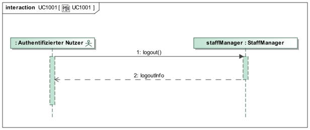
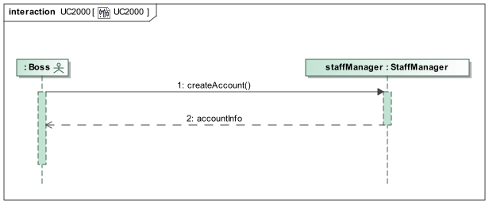
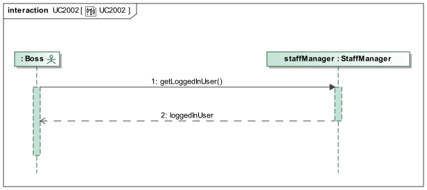
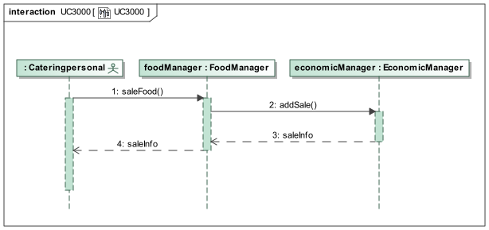

= Pflichtenheft
:project_name: Festivalmanager
== __{project_name}__

[options="header"]
[cols="1, 1, 1, 1, 4"]
|===
|Version | Status      | Bearbeitungsdatum   | Autoren(en) |  Vermerk
|0.1     | In Arbeit   | 10.10.2019          | Autor       | Initiale Version
|===

== Inhaltsverzeichnis
Dieses Dokument benötigt ein Inhaltsverzeichnis. Es existieren mehrere Einbindungsmöglichkeiten.

== Zusammenfassung
Eine kurze Beschreibung des Dokuments. Wenige Absätze.

== Aufgabenstellung und Zielsetzung
Text aus Aufgabenstellung kopieren und ggfs. präzisieren.
Insbesondere ergänzen, welche Ziele mit dem Abschluss des Projektes erreicht werden sollen.

== Produktnutzung
In welchem Kontext soll das System später genutzt werden? Welche Rahmenbedingungen gelten?
Zusätzlich kurze Einleitung für fachfremde Personen

== Interessensgruppen (Stakeholders)
Welche realen und juristischen Personen(-gruppen) haben Einfluss auf die Anforderungen im Projekt?

== Systemgrenze und Top-Level-Architektur

=== Kontextdiagramm
Das Kontextdiagramm zeigt das geplante Software-System in seiner Umgebung. Zur Umgebung gehören alle Nutzergruppen des Systems und Nachbarsysteme. Die Grafik kann auch informell gehalten sein. Überlegen Sie sich dann geeignete Symbole. Die Grafik kann beispielsweise mit Visio erstellt werden. Wenn nötig, erläutern Sie diese Grafik.

=== Top-Level-Architektur
Dokumentieren Sie ihre Top-Level-Architektur mit Hilfe eines Komponentendiagramm.

== Anwendungsfälle

=== Akteure

Akteure sind Nutzer des Systems oder benachbarter Systeme, die auf das System zugreifen. Die folgende Tabelle fasst alle Akteure des Systems zusammen und gibt eine Beschreibung des Akteurs. Abstrakte Akteure (d.h. ein Akteur, der andere Akteure gruppiert, kursiv geschrieben) werden zur Verallgemeinerung und Gruppierung verwendet.

// See http://asciidoctor.org/docs/user-manual/#tables
[options="header"]
[cols="1,4"]
|===
|Name |Beschreibung
[[User]]
|_**<<User>>**_  | Respräsentiert jeden Nutzer des Systems.
[[Nicht_Authentifizierter_Nutzer]]
|**<<Nicht authentifizierter Nutzer>>**  | Respräsentiert jeden nicht authentifizierten Nutzer des Systems.
[[Authentifizierter_Nutzer]]
|_**<<Authentifizierter Nutzer>>**_  | Respräsentiert jeden eingetragenen Nutzer des Systems.
[[Management]]
|**<<Management>>** | Jeder registrierte und authentifizierte Nutzer, mit der Rolle "MANAGEMENT".
[[Ticketverkäufer]]
|**<<Ticketverkäufer>>**  | Jeder registrierte und authentifizierte Nutzer, mit der Rolle "SELLER".
[[Cateringpersonal]]
|**<<Cateringpersonal>>** | Jeder registrierte und authentifizierte Nutzer, mit der Rolle "CATERER".
[[Festivalleiter]]
|**<<Festivalleiter>>**  | Jeder registrierte und authentifizierte Nutzer, mit der Rolle "DIRECTOR".
[[Boss]]
|**<<Boss>>** | Jeder registrierte und authentifizierte Nutzer, mit der Rolle "BOSS".
|===

=== Überblick Anwendungsfalldiagramm
image::./models/analysis/Anwendungsfalldiagramm.svg[Anwendungsfalldiagramm, 100%, 100%, pdfwidth=100%, title= "Anwendungsfalldiagramm von {project_name}", align=center]

=== Anwendungsfallbeschreibungen
Dieser Unterabschnitt beschreibt die Anwendungsfälle. In dieser Beschreibung müssen noch nicht alle Sonderfälle und Varianten berücksichtigt werden. Schwerpunkt ist es, die wichtigsten Anwendungsfälle des Systems zu finden. Wichtig sind solche Anwendungsfälle, die für den Auftraggeber, den Nutzer den größten Nutzen bringen.
Für komplexere Anwendungsfälle ein UML-Sequenzdiagramm ergänzen.
Einfache Anwendungsfälle mit einem Absatz beschreiben.
Die typischen Anwendungsfälle (Anlegen, Ändern, Löschen) können zu einem einzigen zusammengefasst werden.

[cols="1h, 3"]
[[UC1000]]
|===
|ID                          |**<<UC1000>>**
|Name                        |Login
|Beschreibung                |Ein User soll sich authentifizieren können um Zugriff auf weitere Funktionen zu erhalten.
|Akteure                     |<<Nicht_Authentifizierter_Nutzer>>
|Auslöser                    |User möchte auf versteckte Funktionen zugreifen.
|Voraussetzung(en)          a|User ist ein nicht authentifizierter Nutzer
|Wesentliche Schritte       a|

1. User klickt "Einloggen" in der Navigation
2. User gibt seine Login Daten ein
3. User klickt "Login"
4. Daten werden überprüft und User wird bei korrekten Daten auf Startseite weitergeleitet

|Funktionale Anforderungen   |<<F1000>>
|===
image::./models/analysis/Sequenzdiagramme/UC1000.svg["U1000", 100%, 100%, pdfwidth=100%, align=center]

[cols="1h, 3"]
[[UC1001]]
|===
|ID                          |**<<UC1001>>**
|Name                        |Logout
|Beschreibung                |Rückgangig machen des Einloggens.
|Akteure                     |<<Authentifizierter_Nutzer>>
|Auslöser                    |User möchte sich abmelden.
|Voraussetzung(en)          a|User ist ein authentifizierter Nutzer
|Wesentliche Schritte       a|

User klickt "Ausloggen" in der Navigation
User ist jetz unauthentifiziert und die Startseite wird angezeigt

|Funktionale Anforderungen   |<<F1001>>
|===

[cols="1h, 3"]
[[UC2000]]
|===
|ID                          |**<<UC2000>>**
|Name                        |Account erstellen
|Beschreibung                |Ein Boss soll Accounts für seine Angestellten erstellen können.
|Akteure                     |<<Boss>>
|Auslöser                    |Boss möchte Angestellten Zugriff auf versteckte Funktionen erlauben.
|Voraussetzung(en)          a|User hat die Rolle "BOSS"
|Wesentliche Schritte       a|

1. Boss klickt "Organisation" in der Navigation
2. Boss füllt Formular mit Name und Passwort aus
3. Boss bestätigt Eingaben und wird weitergeleitet
4. Account wird angelegt
5. Boss wird auf "Organisation" weitergeleitet

|Funktionale Anforderungen   |<<F2000>>
|===

[cols="1h, 3"]
[[UC2001]]
|===
|ID                          |**<<UC2001>>**
|Name                        |betriebswirtschaftliche Daten abrufen
|Beschreibung                |Ein Boss soll betriebswirtschaftliche Daten abrufen wie Umsatz, Ausgaben, Gewinn abrufen können.
|Akteure                     |<<Boss>>
|Auslöser                    |Boss möchte Ein- und Ausgaben einsehen.
|Voraussetzung(en)          a|User hat die Rolle "BOSS"
|Wesentliche Schritte       a|

1. Boss klickt "Organisation" in der Navigation

|Funktionale Anforderungen   |<<F2000>>
|===
image::./models/analysis/Sequenzdiagramme/UC2001.svg["UC2001", 100%, 100%, pdfwidth=100%, align=center]

[cols="1h, 3"]
[[UC2002]]
|===
|ID                          |**<<UC2002>>**
|Name                        |Angemeldete Mitarbeiter anzeigen
|Beschreibung                |Ein Boss soll abrufen können welche Mitarbeiter derzeitig eingeloggt sind.
|Akteure                     |<<Boss>>
|Auslöser                    |Boss möchte eingeloggte Mitarbeiter sehen
|Voraussetzung(en)          a|Es gibt authentifizierter Nutzer im System
|Wesentliche Schritte       a|

1. Boss klickt "Organisation" in der Navigation

|Funktionale Anforderungen   |<<F2002>>
|===

[cols="1h, 3"]
[[UC3000]]
|===
|ID                          |**<<UC3000>>**
|Name                        |Speisen/Getränke abrechnen
|Beschreibung                |Ein Caterer soll Speisen online abbuchen können.
|Akteure                     |<<Cateringpersonal>>
|Auslöser                    |Caterer möchte Speisen/Getränke abrechnen
|Voraussetzung(en)          a|Es sind noch Speisen/Getränke auf Lager
|Wesentliche Schritte       a|

1. Caterer klickt "Catering" in Navigation
2. Caterer wählt Speise/Getränk in Formular
3. Caterer gibt Anzahl der gekauften Speisen/Getränke ein
4. Caterer bestätigt und wird weitergeleitet
5. Abrechnung wird bearbeitet und Caterer wird auf "Catering" weitergeleitet

|Funktionale Anforderungen   |<<F3000>>
|===

[cols="1h, 3"]
[[UC3001]]
|===
|ID                          |**<<UC3001>>**
|Name                        |Verkaufszahlen des Caterings abrufen
|Beschreibung                |Ein Festivalleiter soll die Verkaufszahlen des Cateringbereichs abrufen können.
|Akteure                     |<<Festivalleiter>>
|Auslöser                    |Festivalleiter klickt "Catering" in der Navigation
|Voraussetzung(en)          a|-
|Wesentliche Schritte       a|

1. Festivalleiter klickt "Catering" in Navigation

|Funktionale Anforderungen   |<<F3000>>
|===
image::./models/analysis/Sequenzdiagramme/UC3001.svg["UC3001", 100%, 100%, pdfwidth=100%, align=center]

[cols="1h, 3"]
[[UC4000]]
|===
|ID                          |**<<UC4000>>**
|Name                        |Ticket verkaufen
|Beschreibung                |Ein Ticketverkäufer soll Ticktes verkaufen können.
|Akteure                     |<<Ticketverkäufer>>
|Auslöser                    |Kunde möchte Ticket(s) kaufen
|Voraussetzung(en)          a|Es sind Tickets verfügbar
|Wesentliche Schritte       a|

1. Ticketverkäufer klickt "Tickets" in Navigation
2. Ticketverkäufer wählt Ticketart
3. Ticketverkäufer gibt Anzahl der Tickets ein
4. Ticketverkäufer bestätigt und wird weitergeleitet
5. Ticketkauf wird bearbeitet und Ticketverkäufer wird auf auf eine Seite weitergeleitet, auf der er das Ticket ausdrucken kann.

|Funktionale Anforderungen   |<<F4000>>
|===
image::./models/analysis/Sequenzdiagramme/UC4000.svg["UC4000", 100%, 100%, pdfwidth=100%, align=center]

[cols="1h, 3"]
[[UC4001]]
|===
|ID                          |**<<UC4001>>**
|Name                        |Ticket drucken
|Beschreibung                |Ein Ticketverkäufer soll Ticktes drucken können.
|Akteure                     |<<Ticketverkäufer>>
|Auslöser                    |Ticketverkäufer möchte Ticket(s) drucken
|Voraussetzung(en)          a|Das Ticket wurde erfolgreich gekauft
|Wesentliche Schritte       a|

1. Ticketverkäufer klickt "Ausdrucken"

|Funktionale Anforderungen   |<<F4001>>
|===
image::./models/analysis/Sequenzdiagramme/UC4001.svg["UC4001", 100%, 100%, pdfwidth=100%, align=center]

[cols="1h, 3"]
[[UC5000]]
|===
|ID                          |**<<UC5000>>**
|Name                        |Kostenaufstellung abrufen
|Beschreibung                |Ein Planer soll die Kostenaufstellen jederzeit einsehen können.
|Akteure                     |<<Management>>
|Auslöser                    |Planer möchte Kostenaufstellung einsehen
|Voraussetzung(en)          a|Das Festival wurde angelegt
|Wesentliche Schritte       a|

1. Planer klickt "Planung" in der Navigation

|Funktionale Anforderungen   |<<F5000>>
|===
image::./models/analysis/Sequenzdiagramme/UC5000.svg["UC5000", 100%, 100%, pdfwidth=100%, align=center]

[cols="1h, 3"]
[[UC5001]]
|===
|ID                          |**<<UC5001>>**
|Name                        |Bereiche anpassen
|Beschreibung                |Ein Planer soll die Festivalbereiche wie Toiletten, Cateringstände, Bühnen anpassen können.
|Akteure                     |<<Management>>
|Auslöser                    |Planer möchte Bereichsänderung vornehmen
|Voraussetzung(en)          a|Das Festival wurde angelegt
|Wesentliche Schritte       a|

1. Planer klickt "Festival" in der Navigation
2. Planer wählt gewünschten Bereich
3. Planer wählt gewünschte Anpassung wie Position, Menge
4. Planer bestätigt Formular un wird weitergeleitet
5. Änderung wird bearbeitet und Planer wird auf "Festival" weitergeleitet

|Funktionale Anforderungen   |<<F5001>>
|===
image::./models/analysis/Sequenzdiagramme/UC5001.svg["UC5001", 100%, 100%, pdfwidth=100%, align=center]

[cols="1h, 3"]
[[UC6000]]
|===
|ID                          |**<<UC6000>>**
|Name                        |Festivalplan anzeigen
|Beschreibung                |Jeder User soll den Festivalplan einsehen können.
|Akteure                     |<<User>>
|Auslöser                    |User möchte Festivalplan einsehen
|Voraussetzung(en)          a|Das Festival wurde angelegt
|Wesentliche Schritte       a|

1. User klickt "Festival" in der Navigation

|Funktionale Anforderungen   |<<F6000>>
|===
image::./models/analysis/Sequenzdiagramme/UC6000.svg["UC6000", 100%, 100%, pdfwidth=100%, align=center]

[cols="1h, 3"]
[[UC6001]]
|===
|ID                          |**<<UC6001>>**
|Name                        |Line-Up anzeigen
|Beschreibung                |Jeder User soll das Line-Up einsehen können.
|Akteure                     |<<User>>
|Auslöser                    |User möchte Line-Up einsehen
|Voraussetzung(en)          a|

1. Das Festival wurde angelegt
2. Es wurden Künstler gebucht

|Wesentliche Schritte       a|

1. User klickt "Festival" in der Navigation

|Funktionale Anforderungen   |<<F6001>>
|===
image::./models/analysis/Sequenzdiagramme/UC6001.svg["UC6001", 100%, 100%, pdfwidth=100%, align=center]

[cols="1h, 3"]
[[UC6002]]
|===
|ID                          |**<<UC6002>>**
|Name                        |Nachrichten von Mitarbeitern abrufen
|Beschreibung                |Ein Festivalleiter soll die Nachrichten von Mitarbeitern abrufen einsehen können.
|Akteure                     |<<Festivalleiter>>
|Auslöser                    |Festivalleiter möchte Nachrichten von Mitarbeitern abrufen
|Voraussetzung(en)          a|Das Festival wurde angelegt
|Wesentliche Schritte       a|

1. Festivalleiter klickt "Festival" in der Navigation

|Funktionale Anforderungen   |<<F6002>>
|===
image::./models/analysis/Sequenzdiagramme/UC6002.svg["UC6002", 100%, 100%, pdfwidth=100%, align=center]

[cols="1h, 3"]
[[UC6003]]
|===
|ID                          |**<<UC6003>>**
|Name                        |Besucherzahlen abrufen
|Beschreibung                |Ein Festivalleiter soll die Besucherzahlen einsehen können.
|Akteure                     |<<Festivalleiter>>
|Auslöser                    |Festivalleiter möchte Besucherzahlen einsehen
|Voraussetzung(en)          a|Das Festival wurde angelegt
|Wesentliche Schritte       a|

1. Festivalleiter klickt "Festival" in der Navigation

|Funktionale Anforderungen   |<<F6003>>
|===

[cols="1h, 3"]
[[UC6004]]
|===
|ID                          |**<<UC6004>>**
|Name                        |Bühnenbelegung abrufen
|Beschreibung                |Ein Festivalleiter soll die Bühnenbelegung einsehen können.
|Akteure                     |<<Festivalleiter>>
|Auslöser                    |Festivalleiter möchte Bühnenbelegung einsehen
|Voraussetzung(en)          a|Das Festival wurde angelegt
|Wesentliche Schritte       a|

1. Festivalleiter klickt "Festival" in der Navigation

|Funktionale Anforderungen   |<<F6004>>
|===
image::./models/analysis/Sequenzdiagramme/UC6004.svg["UC6004", 100%, 100%, pdfwidth=100%, align=center]

[cols="1h, 3"]
[[UC7000]]
|===
|ID                          |**<<UC7000>>**
|Name                        |Produkte nachbestellen
|Beschreibung                |Ein Festivalleiter soll Produkte nachbestellen können.
|Akteure                     |<<Festivalleiter>>
|Auslöser                    |Festivalleiter möchte Produkte nachbestellen
|Voraussetzung(en)          a|Das Festival wurde angelegt
|Wesentliche Schritte       a|

1. Festivalleiter klickt "Lager" in der Navigation
2. Festivalleiter wählt nachzubestellendes Produkt und Menge aus
3. Festivalleiter bestätigt Formular und wird weitergeleitet
4. Nachbestellung wird verarbeitet und Festivalleiter wird auf "Lager" weitergeleitet

|Funktionale Anforderungen   |<<F7000>>
|===
image::./models/analysis/Sequenzdiagramme/UC7000.svg["UC7000", 100%, 100%, pdfwidth=100%, align=center]

[cols="1h, 3"]
[[UC7001]]
|===
|ID                          |**<<UC7001>>**
|Name                        |Lagerbestand anzeigen
|Beschreibung                |Ein Festivalleiter soll den aktuellen Lagerbestand einsehen können.
|Akteure                     |<<Festivalleiter>>
|Auslöser                    |Festivalleiter möchte Lagerbestand einsehen
|Voraussetzung(en)          a|Das Festival wurde angelegt
|Wesentliche Schritte       a|

1. Festivalleiter klickt "Lager" in der Navigation

|Funktionale Anforderungen   |<<F7001>>
|===
image::./models/analysis/Sequenzdiagramme/UC7001.svg["UC7001", 100%, 100%, pdfwidth=100%, align=center]

== Funktionale Anforderungen

=== Muss-Kriterien
Was das zu erstellende Programm auf alle Fälle leisten muss.

=== Kann-Kriterien
Anforderungen die das Programm leisten können soll, aber für den korrekten Betrieb entbehrlich sind.

== Nicht-Funktionale Anforderungen

=== Qualitätsziele

Dokumentieren Sie in einer Tabelle die Qualitätsziele, welche das System erreichen soll, sowie deren Priorität.

=== Konkrete Nicht-Funktionale Anforderungen

Beschreiben Sie Nicht-Funktionale Anforderungen, welche dazu dienen, die zuvor definierten Qualitätsziele zu erreichen.
Achten Sie darauf, dass deren Erfüllung (mindestens theoretisch) messbar sein muss.

== GUI Prototyp

In diesem Kapitel soll ein Entwurf der Navigationsmöglichkeiten und Dialoge des Systems erstellt werden.
Idealerweise entsteht auch ein grafischer Prototyp, welcher dem Kunden zeigt, wie sein System visuell umgesetzt werden soll.
Konkrete Absprachen - beispielsweise ob der grafische Prototyp oder die Dialoglandkarte höhere Priorität hat - sind mit dem Kunden zu treffen.

=== Überblick: Dialoglandkarte
Erstellen Sie ein Übersichtsdiagramm, das das Zusammenspiel Ihrer Masken zur Laufzeit darstellt. Also mit welchen Aktionen zwischen den Masken navigiert wird.
//Die nachfolgende Abbildung zeigt eine an die Pinnwand gezeichnete Dialoglandkarte. Ihre Karte sollte zusätzlich die Buttons/Funktionen darstellen, mit deren Hilfe Sie zwischen den Masken navigieren.

=== Dialogbeschreibung
Für jeden Dialog:

1. Kurze textuelle Dialogbeschreibung eingefügt: Was soll der jeweilige Dialog? Was kann man damit tun? Überblick?
2. Maskenentwürfe (Screenshot, Mockup)
3. Maskenelemente (Ein/Ausgabefelder, Aktionen wie Buttons, Listen, …)
4. Evtl. Maskendetails, spezielle Widgets

== Datenmodell

=== Überblick: Klassendiagramm
UML-Analyseklassendiagramm

=== Klassen und Enumerationen
Dieser Abschnitt stellt eine Vereinigung von Glossar und der Beschreibung von Klassen/Enumerationen dar. Jede Klasse und Enumeration wird in Form eines Glossars textuell beschrieben. Zusätzlich werden eventuellen Konsistenz- und Formatierungsregeln aufgeführt.

// See http://asciidoctor.org/docs/user-manual/#tables
[options="header"]
|===
|Klasse/Enumeration |Beschreibung |
|…                  |…            |
|===

== Akzeptanztestfälle
Mithilfe von Akzeptanztests wird geprüft, ob die Software die funktionalen Erwartungen und Anforderungen im Gebrauch erfüllt. Diese sollen und können aus den Anwendungsfallbeschreibungen und den UML-Sequenzdiagrammen abgeleitet werden. D.h., pro (komplexen) Anwendungsfall gibt es typischerweise mindestens ein Sequenzdiagramm (welches ein Szenarium beschreibt). Für jedes Szenarium sollte es einen Akzeptanztestfall geben. Listen Sie alle Akzeptanztestfälle in tabellarischer Form auf.
Jeder Testfall soll mit einer ID versehen werde, um später zwischen den Dokumenten (z.B. im Test-Plan) referenzieren zu können.

== Glossar
Sämtliche Begriffe, die innerhalb des Projektes verwendet werden und deren gemeinsames Verständnis aller beteiligten Stakeholder essentiell ist, sollten hier aufgeführt werden.
Insbesondere Begriffe der zu implementierenden Domäne wurden bereits beschrieben, jedoch gibt es meist mehr Begriffe, die einer Beschreibung bedürfen. +
Beispiel: Was bedeutet "Kunde"? Ein Nutzer des Systems? Der Kunde des Projektes (Auftraggeber)?

== Offene Punkte
Offene Punkte werden entweder direkt in der Spezifikation notiert. Wenn das Pflichtenheft zum finalen Review vorgelegt wird, sollte es keine offenen Punkte mehr geben.
